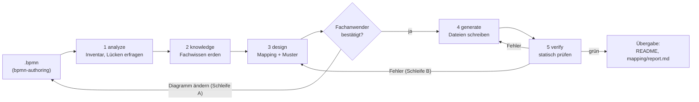

# Architektur

Wie bpmn2agent aus einem BPMN-Diagramm prüfbare Claude-Code-Artefakte macht, welche Teile es dafür
gibt und wo man was ändert. Die Verzeichnisübersicht steht in `README.md`.

## Idee in einem Satz

Ein Fachanwender zeichnet einen Prozess als BPMN (Lane = Rolle), eine Kette von Skills übersetzt
ihn Schritt für Schritt in eine Spezifikation (`workflow-spec.yaml`), lässt die Übersetzung vom
Fachanwender bestätigen und schreibt daraus Agenten, Skills, Skripte, Hooks und genau eine
Orchestrierungsdatei, jede mit Rückverweis auf ihr BPMN-Element.

## Ablauf



`bpmn-to-agentic-workflow` ist der Einstieg. Er macht selbst nichts Inhaltliches, sondern ruft die
fünf Stufen-Skills nacheinander auf, trägt die beiden Schleifen und berichtet am Ende. Jede Frage an
den Menschen läuft über `AskUserQuestion` mit Optionen und einer Empfehlung, in der Sprache des
Anwenders.

| Stufe | Skill | Liest | Schreibt |
|---|---|---|---|
| 0 | `bpmn-authoring` | – | das `.bpmn` (XSD, bpmn-moddle, bpmnlint, Layout) |
| 1 | `bpmn2agent-analyze` | `.bpmn` | `workflow-spec.yaml` als Entwurf, jedes Element `kind: unresolved` |
| 2 | `bpmn2agent-knowledge` | Spec, NotebookLM / Web | `knowledge:`, `openQuestions:`, `knowledge/*.md`, `knowledge/faq/` |
| 3 | `bpmn2agent-design` | Spec, Rubriken | bestätigte Spec: `kind`, Pfade, Muster, Rollen, Artefakte |
| 4 | `bpmn2agent-generate` | bestätigte Spec, Vorlagen | alle Dateien unter `generated/<workflow>/` |
| 5 | `bpmn2agent-verify` | `generated/<workflow>/`, `.bpmn` | nichts; Bericht in sechs Kategorien |

Wiederholte Läufe sind der Normalfall: analyze vergleicht das `.bpmn` per Element-ID und sha256 und
fragt nur nach Neuem oder Geändertem; design fasst bereits entschiedene Elemente nicht an.

## Die Spezifikation als Drehscheibe

Alle Stufen reden nur über `generated/<workflow>/workflow-spec.yaml` miteinander. Das Schema liegt in
`bpmn2agent-design/assets/workflow-spec.schema.yaml`.

| Schlüssel | Inhalt |
|---|---|
| `meta` | Quell-`.bpmn` mit Pfad und sha256, Workflow-Name, Sprache |
| `roles` | eine Rolle je Lane: `agentName`, optional `modelTier` und `tools` |
| `elements` | ein Eintrag je BPMN-Element: `kind`, `lane`, `generatedPaths`, `reason`, `gate` (Kriterien, `maxLoops`), `knowledge` |
| `artifacts` | ein Vertrag je Datenobjekt: Pfadmuster, Frontmatter-Felder, Erzeuger, Verbraucher |
| `pattern` | gewähltes Orchestrierungsmuster, Begründung, verworfene Alternativen, ggf. Phasen |
| `knowledge` | Notebooks je Lane/Element, Modus (`notebook`, `websearch`, `local-docs`, `unverified`), `refs` |
| `openQuestions` | Befunde aus der Wissensprüfung mit Antwort des Anwenders |

## Übersetzungsregeln

`bpmn2agent-design/references/mapping-rubric.md` entscheidet je Element:

| BPMN | wird zu |
|---|---|
| Lane | Agent-Rolle |
| `serviceTask` | Skill (wiederverwendet, braucht Material, eigenes Artefakt) oder Checklistenpunkt des Agenten |
| `userTask` / `manualTask` | menschlicher Prüfpunkt (`AskUserQuestion`) |
| `scriptTask` | Skript im Skill der Lane |
| `businessRuleTask`, Bedingung | Skript; Hook nur, wenn ein Tool-Aufruf physisch blockiert werden muss |
| Gateway, Schleife, Start/Ende | Steuerlogik im Orchestrierungsmuster, keine eigene Datei |
| aufgeklappter Teilprozess / Call Activity | wiederverwendbarer Skill oder eigener Teil-Workflow |
| Datenobjekt | Artefaktvertrag |

`pattern-rubric.md` wählt aus Signalen des Diagramms (menschliche Aufgaben, Parallelität,
Mehrfachinstanzen, Schleifen, Urteils-Gateways) eines von vier Mustern:

| Muster | passt, wenn | erzeugt |
|---|---|---|
| Skill-Kette + Hooks | ein Mensch ist dabei, Ablauf fast linear | `skills/<workflow>/SKILL.md` als Rückgrat |
| Workflow-Skript | unbeaufsichtigt, echte Parallelität, deterministische Verzweigungen | `<workflow>.workflow.mjs` (wird nie automatisch gestartet) |
| Orchestrator-Agent | Verzweigungen brauchen Urteil im Einzelfall | `agents/<workflow>-orchestrator.md` plus Spezialisten |
| gemischt | Phasen haben unterschiedliche Form | je Phase eines der drei |

Jede Schleife hat eine Obergrenze (`maxLoops`, Standard 3); ist sie erreicht, geht es mit einem
Risikohinweis weiter.

Nicht unterstützte Konstrukte (Pools mit Nachrichtenflüssen, Timer- und Nachrichtenereignisse,
Event-Teilprozesse, Kompensation) meldet analyze mit einem Umbauvorschlag
(`bpmn2agent-analyze/references/unsupported.md`). Bleibt der Anwender dabei, wird das Element als
bewusste Lücke `not-generated`.

## Ergebnis und Rückverfolgbarkeit

```text
generated/<workflow>/
  workflow-spec.yaml         # die Drehscheibe
  README.md                  # Installationsanleitung für den Anwender
  agents/  skills/  hooks/   # die Artefakte
  <workflow>.workflow.mjs    # nur beim Muster Workflow-Skript
  knowledge/*.md             # destilliertes, belegtes Fachwissen je Element/Lane
  knowledge/faq/             # Notebook-Fragen im Wortlaut mit Belegstellen
  mapping/                   # report.md, workflow-mapped.bpmn (farbig), index.html, PNGs
```

Die Pipeline schreibt nie direkt nach `.agents/` oder `.claude/`; installiert wird erst auf Wunsch
des Anwenders nach `README.md`.

Jede erzeugte Datei trägt `bpmn: {file, elements}` (Frontmatter bei Markdown, Kopfkommentar bei
Skripten). `bpmn2agent-verify/scripts/verify.mjs` prüft das in beide Richtungen:

1. **spec-schema** – die Spec entspricht dem Schema.
2. **source-bpmn** – sha256 stimmt noch, das `.bpmn` ist weiter gültig.
3. **element-to-artifact** – jedes Element hat einen Eintrag, jeder versprochene Pfad existiert.
4. **artifact-to-element** – jede Datei hat einen gültigen Kopf und lässt sich einem Element, einem
   Skill-/Agent-Ordner, `knowledge.refs` oder der einen Orchestrierungsdatei zuordnen.
5. **lint** – Hook-JSON, `node --check` für Skripte, Workflow-Skript-Syntax.
6. **no-red** – kein `unresolved`, keine offene Frage, die Mapping-Ansicht ist gültig.

Die Mapping-Ansicht färbt jedes Element nach Ergebnis (erzeugt, Steuerlogik, bewusst nicht erzeugt,
rot = offen) und verlinkt es mit seiner Datei.

## Wissensschicht

Zwei Arten von Wissen, zwei Orte:

| | Fachwissen des Prozesses | Wissen über Agentic Design |
|---|---|---|
| Frage | Was tut die Rolle, welche Kriterien gelten? | Welches Muster, wie schneidet man Agenten, wo gehört ein Prüfpunkt hin? |
| Quelle | Notebooks des Anwenders, Web, vorhandene Repo-Dokumente | NotebookLM-Notebook „Agentic Workflows“ |
| Ablage | `generated/<workflow>/knowledge/` | `.agents/skills/agentic-workflow-kb/` |
| Wer | `bpmn2agent-knowledge` | design, generate, verify über die Helfer unten |

Beide folgen demselben Muster in drei Schichten, billigste zuerst:

1. **FAQ** – jede Notebook-Frage im Wortlaut, die Antwort unverändert und eine Tabelle, die jede
   Belegnummer auf Quelle und zitierte Textstelle auflöst. Index in `faq/README.md`.
2. **Destillat** – kurze Leitlinien (`references/*.md` bzw. `knowledge/*.md`). Jede Aussage trägt
   einen Verweis wie `[agent-design-1: 3, 5]` = FAQ-Eintrag, Belegnummern.
3. **Notebook** – nur für Fragen, die 1 und 2 nicht beantworten. Die neue Antwort kommt sofort ins
   FAQ, damit der nächste Lauf sie findet.

`.agents/skills/bpmn2agent-knowledge/scripts/notebook-faq.py add` macht aus einem gespeicherten
`notebook_query`-Ergebnis einen FAQ-Eintrag; `faq/sources.json` löst die Quellen-IDs des Notebooks
in lesbare Titel auf. Aussagen ohne Quelle werden als `⚠ unverified` markiert und nie nachträglich
zu „belegt“ hochgestuft.

## Helfer für die Stufen

Keine eigenen Stufen; die Stufen-Skills rufen sie an festen Stellen auf.

| Helfer | Art | Einsatz |
|---|---|---|
| `agentic-workflow-kb` | Skill | belegte Antworten auf Designfragen (FAQ + Referenzen) |
| `agentic-kb-librarian` | Agent | beantwortet Designfragen, fragt sonst das Notebook und ergänzt das FAQ |
| `orchestration-design` | Skill | acht Prüffragen zur Orchestrierung; design Schritt 6a |
| `agentic-workflow-architect` | Agent, nur lesend | prüft den Spec-Entwurf vor dem Mapping-Plan; design Schritt 6a |
| `agent-authoring` | Skill | Rolle schneiden, Agenten schreiben und prüfen; design 5, generate 3/7 |
| `skill-authoring` | Skill | Skills schreiben und prüfen; generate 5 |
| `agentic-artifact-reviewer` | Agent, nur lesend | Qualitätsprüfung der erzeugten Dateien; generate 11, verify (beratend) |
| `trim-the-fat` | Skill, nur auf Anforderung | kürzt Skills, ohne ihr Verhalten zu ändern; generate 11, nur wenn der Anwender zustimmt |

Befunde der Prüf-Agenten tragen ein Ziel: `design` (in der Spec lösbar), `generate` (Formulierung,
Vorlage), `trim` (nur zu lang, Verhalten unverändert – Fall für `trim-the-fat`) oder `bpmn` (das
Diagramm muss sich ändern – geht als Schleife A zum Anwender zurück; die Pipeline ändert nie selbst
die Struktur des Diagramms).

## Werkzeuge

- `node`, `python3`, `xmllint`. npm-Pakete (`bpmn-moddle`, `bpmnlint`, `js-yaml`, `ajv`,
  `playwright`) liegen in `~/.cache/bpmn-authoring-tools` (`BPMN_TOOLS_CACHE`) und werden beim
  ersten Lauf dort installiert, nie im Repo.
- Wichtige Skripte: `bpmn-authoring/scripts/validate.sh` (BPMN prüfen), `render.mjs` (BPMN als PNG),
  `bpmn2agent-analyze/scripts/inventory.mjs` (Elementinventar und Signale),
  `bpmn2agent-generate/scripts/render-mapping.mjs` (Mapping-Ansicht),
  `bpmn2agent-verify/scripts/verify.mjs` (die sechs Prüfungen),
  `bpmn2agent-knowledge/scripts/notebook-faq.py` (FAQ).
- NotebookLM über den MCP-Server `gemini-notebook-mcp`; bei Anmeldefehlern `nlm login`.

## Beispiele

- `examples/dark-factory/` – vollständiger Lauf „Von der Produktvision zu User Stories“ als
  Schnappschuss. `generated/` wird nur über `tools/dark-factory-gen/regenerate.sh` erneuert.
- `examples/user-story-refinement/` – neue User Story aus Feedback, noch nicht durch die Pipeline;
  die Notebook-Frage dahinter liegt in `notebook-faq/`.

## Wo ändere ich was?

| Ich will … | Datei |
|---|---|
| die Übersetzung eines BPMN-Elements ändern | `bpmn2agent-design/references/mapping-rubric.md` |
| die Musterwahl ändern | `bpmn2agent-design/references/pattern-rubric.md` |
| ein Feld in der Spec ergänzen | `workflow-spec.schema.yaml`, dann analyze/design/generate/verify nachziehen |
| Aussehen erzeugter Agenten/Skills ändern | `bpmn2agent-generate/assets/templates/` |
| eine Prüfung ergänzen | `bpmn2agent-verify/scripts/verify.mjs` |
| Designwissen ergänzen | Notebook fragen, `notebook-faq.py add`, Destillat in `agentic-workflow-kb/references/` |
| einen Skill kürzen | `/trim-the-fat` aufrufen; bei erzeugten Skills besser die Vorlage in `bpmn2agent-generate/assets/templates/` straffen |
| einen Skill oder Agenten hinzufügen | echte Datei in `.agents/skills/` bzw. `.agents/agents/`, relativer Symlink aus `.claude/` |
