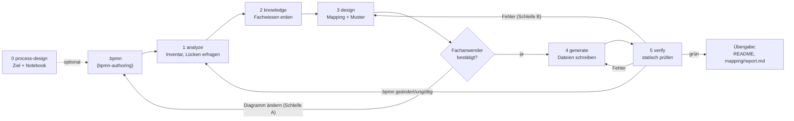

# Architektur

Wie bpmn2agent aus einem BPMN-Diagramm prüfbare Claude-Code-Artefakte macht, welche Teile es dafür
gibt und wo man was ändert. Die Verzeichnisübersicht steht in `README.md`.

## Idee in einem Satz

Ein Fachanwender zeichnet einen Prozess als BPMN (Lane = Rolle) oder lässt ihn von
`bpmn-process-design` aus Ziel und Notebook entwerfen; eine Kette von Skills übersetzt
ihn Schritt für Schritt in eine Spezifikation (`workflow-spec.yaml`), lässt die Übersetzung vom
Fachanwender bestätigen und schreibt daraus Agenten, Skills, Skripte, Hooks und genau eine
Orchestrierungsdatei, jede mit Rückverweis auf ihr BPMN-Element.

## Ablauf



`bpmn-to-agentic-workflow` ist der Einstieg. Er macht selbst nichts Inhaltliches, sondern ruft die
fünf Stufen-Skills nacheinander auf, trägt die beiden Schleifen und berichtet am Ende. Jede Frage an
den Menschen läuft über `AskUserQuestion` mit Optionen und einer Empfehlung, in der Sprache des
Anwenders.

Schleifen der Pipeline selbst: Schleife A beendet den Lauf, der Anwender ändert das Diagramm und
startet neu (die bestätigte Spec ist der Punkt, an dem eine neue Sitzung weitermacht). Schleife B
läuft höchstens dreimal; danach, oder wenn derselbe Befund unverändert wiederkommt, entscheidet der
Anwender: zurück ins Design, Diagramm ändern oder Übergabe als „unverifiziert“. Das Nachjustieren im
Mapping-Plan ist ebenfalls auf drei Runden begrenzt.

### Warum die Pipeline selbst kein Workflow-Skript ist

Die Pipeline ist eine Skill-Kette, kein Claude-Code-Workflow-Skript, und soll es bleiben. Nach ihrer
eigenen `pattern-rubric.md` ist sie ein beaufsichtigter, fast linearer Ablauf ohne parallele
Gateways – Zeile 1, Skill-Kette. Dazu kommen harte Gründe:

- Jede Stufe fragt den Anwender; die `agent()`-Unteragenten eines Workflow-Skripts können kein
  `AskUserQuestion` stellen.
- Ein Workflow muss jedes Mal ausdrücklich gestartet werden und läuft im Hintergrund – eine weitere
  Freigabe in einem Ablauf, der ohnehin viele Fragen stellt.
- Fortsetzen geht dort nur in derselben Sitzung; Schleife A setzt aber über Sitzungen fort. Das
  leistet schon die Spec (sha256, Diff je Element).

Die Drei-von-fünf-Regel (`agentic-workflow-kb/references/claude-code-workflows.md`) erfüllt nur
die Wissensextraktion über viele Lanes × Notebooks. Auch dort reichen parallele `Agent`-Aufrufe aus
dem Stufen-Skill; ein Workflow-Skript lohnt erst, wenn das deutlich wächst. Workflow-Skripte
erzeugt die Pipeline weiterhin als *Ergebnis*, wenn das gezeichnete Diagramm dazu passt.

| Stufe | Skill | Liest | Schreibt |
|---|---|---|---|
| 0 | `bpmn-process-design` (optional) | Ziel des Anwenders, NotebookLM | das `.bpmn` in FlowSpec-Notation, `knowledge/faq/` |
| 0 | `bpmn-authoring` | – | das `.bpmn` von Hand (XSD, bpmn-moddle, bpmnlint, Layout) |
| 1 | `bpmn2agent-analyze` | `.bpmn` | `workflow-spec.yaml` als Entwurf, jedes Element `kind: unresolved`; Stores und Prozess-Ein-/Ausgabe als `contextSources` / `workflowIO` |
| 2 | `bpmn2agent-knowledge` | Spec, NotebookLM / Web, Wissens-Stores | `knowledge:`, `openQuestions:`, `knowledge/*.md`, `knowledge/faq/` |
| 3 | `bpmn2agent-design` | Spec, Rubriken | bestätigte Spec: `kind`, Pfade, Muster, Rollen, Artefakte, aufgelöste Tools der Live-Stores |
| 4 | `bpmn2agent-generate` | bestätigte Spec, Vorlagen | alle Dateien unter `generated/<workflow>/` |
| 5 | `bpmn2agent-verify` | `generated/<workflow>/`, `.bpmn` | nichts; Bericht in sechs Kategorien |

Wiederholte Läufe sind der Normalfall: analyze vergleicht das `.bpmn` per Element-ID und sha256 und
fragt nur nach Neuem oder Geändertem; design fasst bereits entschiedene Elemente nicht an.

## Die Spezifikation als Drehscheibe

Alle Stufen reden nur über `generated/<workflow>/workflow-spec.yaml` miteinander. Das Schema liegt in
`bpmn2agent-design/assets/workflow-spec.schema.yaml`.

| Schlüssel | Inhalt |
|---|---|
| `meta` | Quell-`.bpmn` mit Pfad und sha256, Workflow-Name, Sprache |
| `roles` | eine Rolle je Lane: `agentName`, optional `modelTier` und `tools` |
| `elements` | ein Eintrag je BPMN-Element: `kind`, `lane`, `generatedPaths`, `reason`, `gate` (Kriterien, `maxLoops`), `knowledge` |
| `artifacts` | ein Vertrag je Datenobjekt: Pfadmuster, Frontmatter-Felder, Erzeuger, Verbraucher |
| `pattern` | gewähltes Orchestrierungsmuster, Begründung, verworfene Alternativen, ggf. Phasen |
| `contextSources` | ein Eintrag je Data Store: `art`, `ort`, `readers`, `writers`, bei `live` die aufgelösten `tools`, bei `gedaechtnis` `memory` (siehe [Kontextquellen](#kontextquellen)) |
| `workflowIO` | Eingabe des ganzen Prozesses (Artefakt, Pflichtfelder) und sein Endergebnis |
| `knowledge` | Notebooks je Lane/Element, Modus (`notebook`, `websearch`, `local-docs`, `unverified`), `refs` |
| `openQuestions` | Befunde aus der Wissensprüfung mit Antwort des Anwenders |

## Übersetzungsregeln

`bpmn2agent-design/references/mapping-rubric.md` entscheidet je Element:

| BPMN | wird zu |
|---|---|
| Lane | Rolle; eigener Agent nur beim Muster Orchestrator-Agent |
| `serviceTask` | Skill (wiederverwendet, braucht Material, eigenes Artefakt) oder Checklistenpunkt des Agenten |
| `userTask` / `manualTask` | menschlicher Prüfpunkt (`AskUserQuestion`) |
| `scriptTask` | Skript im Skill der Lane |
| `businessRuleTask`, Bedingung | mechanische Regel → Skript; Prüfung mit Urteil (INVEST, DoR) → Checkliste im Skill; Hook nur, wenn ein Tool-Aufruf physisch blockiert werden muss |
| Gateway, Schleife, Start/Ende | Steuerlogik im Orchestrierungsmuster, keine eigene Datei |
| aufgeklappter Teilprozess / Call Activity | wiederverwendbarer Skill oder eigener Teil-Workflow |
| Datenobjekt | Artefaktvertrag |
| Data Store | Kontextquelle (`contextSources`), je nach `Art:` Wissensreferenz, Tool-Freigabe oder Gedächtnisdatei |
| prozessweite Ein-/Ausgabe | `workflowIO`; die Eingabe wird zum `argument-hint` des Orchestrators |

`pattern-rubric.md` wählt aus Signalen des Diagramms (menschliche Aufgaben, Parallelität,
Mehrfachinstanzen, Schleifen, Urteils-Gateways) eines von vier Mustern:

| Muster | passt, wenn | erzeugt |
|---|---|---|
| Skill-Kette + Hooks | ein Mensch ist dabei, Ablauf fast linear | `.claude/skills/<workflow>/SKILL.md` als Rückgrat |
| Workflow-Skript | unbeaufsichtigt, echte Parallelität, deterministische Verzweigungen | `.claude/workflows/<workflow>.workflow.mjs` (wird nie automatisch gestartet) |
| Orchestrator-Agent | Verzweigungen brauchen Urteil im Einzelfall | `.claude/agents/<workflow>-orchestrator.md` plus Spezialisten |
| gemischt | Phasen haben unterschiedliche Form | je Phase eines der drei |

Jede Schleife hat eine Obergrenze (`maxLoops`, Standard 3); ist sie erreicht, geht es mit einem
Risikohinweis weiter.

Nicht unterstützte Konstrukte (Pools mit Nachrichtenflüssen, Timer- und Nachrichtenereignisse,
Event-Teilprozesse, Kompensation) meldet analyze mit einem Umbauvorschlag
(`bpmn2agent-analyze/references/unsupported.md`). Bleibt der Anwender dabei, wird das Element als
bewusste Lücke `not-generated`.

## Kontextquellen

Kontext ist am Ende Daten. Wer einen Prozess modelliert, überlegt deshalb beim Zeichnen, **welche
Daten jeder Schritt braucht und wo sie liegen**. Daraus baut die Pipeline Wissensreferenzen,
Tool-Freigaben, Schreibschutz und ein Gedächtnis über Läufe hinweg. Das Detaildesign steht in
[`docs/plans/kontextquellen/plan.md`](docs/plans/kontextquellen/plan.md).

**Notation.** Jede dauerhafte Quelle ist ein Data Store (Zylinder), benannt als fachlicher
Datenbestand („Jira-Tickets Projekt LANE“), nicht als System. Seine Dokumentation trägt zwei Zeilen:

```text
Art: wissen | live | gedächtnis
Ort: notebook:<Titel> | mcp:<Server> | cli:<Befehl> | <URL> | datei:<Pfad> | websearch
```

Lesen oder Schreiben ergibt sich nur aus der Pfeilrichtung: Store → Task liest, Task → Store
schreibt. Es gibt keine `Zugriff:`-Zeile. Fehlt eine Zeile oder passt die Kombination nicht, fragt
analyze nach, die Pipeline rät nie. (`Ort:` statt `Quelle:`, weil die Task-Dokumentation `Quelle:`
schon für die Herkunft belegt.)

| Art | erlaubter Ort | geladen | wird zu |
|---|---|---|---|
| `wissen` | `notebook:`, URL, `datei:`, `websearch` (`mcp:` nur als Snapshot bei verbundenem Server) | bei der Generierung | `knowledge/<taskId>.md`, dann `references/` des Skills |
| `live` | `mcp:`, `cli:` | zur Laufzeit | Tool-Allowlist + `## Kontextquellen` im Skill |
| `live` | `notebook:` (wie `mcp:gemini-notebook-mcp`), URL, `datei:` | zur Laufzeit | Tool-Allowlist bzw. `WebFetch` / `Read` |
| `gedächtnis` | `datei:` (Standard `.claude/memory/<workflow>/<store>.md`) | zu Laufbeginn gelesen, am Ende geschrieben | kuratierte Datei + Cap-Hook |

**Weg durch die Stufen.**

| Stufe | Was mit den Stores passiert |
|---|---|
| 0 process-design | fragt je Schritt „Was muss er wissen, und wo liegt es?“ und zeichnet die Stores samt `Art:`/`Ort:` |
| 1 analyze | inventarisiert Stores und Prozess-Ein-/Ausgabe nach `contextSources` / `workflowIO`, fragt bei fehlenden oder unpassenden Zeilen nach |
| 2 knowledge | extrahiert für jeden lesenden Task aus genau den Wissens-Stores seiner Pfeile, eine Datei `knowledge/<taskId>.md` mit einem Abschnitt je Store; ohne Wissens-Store gilt die alte Lane-Zuordnung |
| 3 design | löst die Tools der Live-Stores per ToolSearch auf (lesen/schreiben nach Name oder `readOnlyHint`, unklar = schreiben), platziert sie (`tools:` je Lane-Agent beim Orchestrator-Agent, sonst `permissions.allow`) und legt alles im Mapping-Plan zur Bestätigung vor |
| 4 generate | schreibt `## Kontextquellen`-Abschnitte, `permissions.allow`, den Write-Guard-Hook (`ask`), den Memory-Cap-Hook und das `argument-hint` des Orchestrators |
| 5 verify | prüft in einer eigenen Kategorie, dass jeder Store im Trace steht und Leser/Schreiber zu den Pfeilen passen, und dass vor jedem Live-Schreiben ein `userTask` liegt |

**Regeln.**

- **Ein `userTask` vor jedem Schreiben in einen Live-Store**, auf jedem Pfad. verify meldet sonst
  einen Fehler, design bricht ab und schickt den Anwender ins Diagramm. Ein PreToolUse-Hook
  (`<workflow>-write-guard.mjs`) fragt zusätzlich beim Aufruf der Schreib-Tools
  (`permissionDecision: "ask"`). Eine Phase mit Live-Schreiben ist nie ein Workflow-Skript.
- **Gedächtnis ist ein kuratiertes Dokument** mit den Abschnitten *Bewährt*, *Vermeiden*, *Offene
  Muster* und höchstens 150 Zeilen. Es braucht einen schreibenden `serviceTask` und einen Leser;
  Schreiben braucht keine Freigabe. Ein PostToolUse-Hook (`<workflow>-memory-cap.mjs`) meldet
  darüber Exit 2 mit „verdichten“.
- **Nicht aufgelöste Tools werden nie zu Wildcards.** Ist der Server nicht verbunden, bleibt der
  Store `tools: unresolved`, verify warnt und generate lässt die Tools weg.
- **Rückverfolgung:** Stores tragen `kind: context-source`, Prozess-Ein-/Ausgabe `workflow-input` /
  `workflow-output`; die Mapping-Ansicht färbt Stores rosé, ein Store ohne Eintrag ist rot. Die
  Memory-Dateien entstehen erst im Projekt des Anwenders, nicht im Output.

**Bewusst nicht in v1:** Datenzustände (`[freigegeben]`) und daraus abgeleitete Status-Hooks,
Freigabe-Records zur Laufzeit, zusätzliche Lint-Regeln (toter Store, `serviceTask` ohne Eingang),
Pro-Lane-Tools im Workflow-Skript-Muster und die Erzeugung einer `.mcp.json` (keine Endpunkte oder
Zugangsdaten im Output). Das Beispiel `dark-factory` bleibt Schnappschuss. Als Prüfstand dienen die
Fixtures unter `.agents/skills/bpmn2agent-verify/fixtures/` (`context-flow.bpmn` grün,
`context-flow-unguarded.bpmn` muss den Schreibfehler melden).

## Ergebnis und Rückverfolgbarkeit

```text
generated/<workflow>/
  .claude/                   # Nutzlast im Aufbau eines Projekt-.claude/ (meta.outputLayout: claude-dir)
    agents/  skills/         #   die Artefakte; skills/<x>/scripts/ nur für echte Skript-Elemente
    hooks/*.mjs              #   bei kind: hook; dazu Write-Guard und Memory-Cap bei Kontextquellen, immer Kostenprotokoll und -karte
    settings.json            #   meldet jeden Hook an ("$CLAUDE_PROJECT_DIR"/.claude/hooks/…), permissions.allow für Lese-Tools
    workflows/<workflow>.workflow.mjs  # nur beim Muster Workflow-Skript
  workflow-spec.yaml         # die Drehscheibe
  workflow-spec.draft.yaml   # nur während design (Schritt 6a–8), Eingabe des Architekten
  README.md                  # Installation: eine Kopie von .claude/
  knowledge/*.md             # destilliertes, belegtes Fachwissen je Element/Lane
  knowledge/faq/             # Notebook-Fragen im Wortlaut mit Belegstellen
  mapping/                   # report.md, workflow-mapped.bpmn (farbig), index.html, PNGs
```

Die Pipeline schreibt nie in ein echtes `.claude/`; installiert wird auf Wunsch des Anwenders mit
`cp -R generated/<workflow>/.claude/. <projekt>/.claude/`. Skripte sind eine Datei mit
Node-Bordmitteln, ohne npm-Pakete und ohne Installationsschritt; `verify.mjs` lässt eine
claude-dir-Ausgabe durchfallen, die das bricht, oder deren `settings.json` nicht genau die Hooks
anmeldet. Specs ohne `outputLayout` (das `dark-factory`-Beispiel) behalten den alten Aufbau mit
`skills/`, `agents/`, `hooks/*.hook.settings.json` direkt unter `generated/<workflow>/`.

Jede erzeugte Datei trägt `bpmn: {file, elements}` (Frontmatter bei Markdown, Kopfkommentar bei
Skripten). `bpmn2agent-verify/scripts/verify.mjs` prüft das in beide Richtungen:

1. **spec-schema** – die Spec entspricht dem Schema.
2. **source-bpmn** – sha256 stimmt noch, das `.bpmn` ist weiter gültig.
3. **element-to-artifact** – jedes Element hat einen Eintrag, jeder versprochene Pfad existiert.
4. **artifact-to-element** – jede Datei hat einen gültigen Kopf und lässt sich einem Element, einem
   Skill-/Agent-Ordner, `knowledge.refs` oder der einen Orchestrierungsdatei zuordnen.
5. **lint** – Hook-JSON, `node --check` für Skripte, Workflow-Skript-Syntax.
6. **no-red** – kein `unresolved`, keine offene Frage, die Mapping-Ansicht ist gültig.

Dazu kommt, nur wenn das Diagramm Stores oder Prozess-Ein-/Ausgabe hat, die Kategorie
**context-sources** (siehe [Kontextquellen](#kontextquellen)); sonst bleibt die Ausgabe unverändert.

Die Mapping-Ansicht färbt jedes Element nach Ergebnis (erzeugt, Steuerlogik, bewusst nicht erzeugt,
rot = offen) und verlinkt es mit seiner Datei.

## Laufkosten

Was ein Lauf eines erzeugten Workflows gekostet hat und welcher Teil des Diagramms wie viel davon,
lässt sich ohne Schätzung durch das Modell messen: Tokens stehen exakt in den Session-Transkripten,
Preise in einer Tabelle, und die BPMN-Element-ID steckt in jedem Label. Design und Messergebnisse:
`docs/plans/laufkosten/plan.md` und `spike.md`.

**Der Payload trägt Daten, das Plugin die Logik.**

| Teil | liegt in | Aufgabe |
|---|---|---|
| `hooks/<workflow>-cost-ledger.mjs` | erzeugter Payload (generate 6b, immer) | hängt bei `SubagentStop`, `Stop` und `SessionEnd` jede abgeschlossene API-Anfrage einmal an `.claude/runs/<workflow>/ledger.jsonl` an: rohe Token-Zahlen, keine Preise, kein Netz, bricht nie einen Lauf ab |
| `hooks/<workflow>-cost-map.json` | erzeugter Payload | schlüsselt auf, welcher Skill, Agent-Typ und welche Element-ID im Transkript zu welchem Element, welcher Lane und welcher Phase gehört; `verify` prüft sie gegen die Spec |
| `bpmn2agent-cost` | FlowForge-Plugin | `cost-report.mjs` rechnet mit `prices.json`, ordnet zu und gleicht ab; `cost-bench.mjs` wiederholt Läufe; `render-mapping.mjs --cost` blendet die Kosten in die Mapping-Ansicht ein |

**Zuordnung je API-Anfrage** (erste Regel, die passt): Beschreibung des Subagents beginnt mit einer
Element-ID → dieses Element; Agent-Typ des Orchestrators → *Orchestrierung*; `attributionSkill` ist
ein Skill der Karte → sein Element (teilen sich mehrere Elemente den Skill, die Skill-Gruppe);
Agent-Typ einer Lane → diese Lane; Hauptthread → *Orchestrierung*; sonst *nicht zugeordnet*. Nichts
wird verteilt oder geschätzt. Voraussetzung ist die Label-Konvention: jeder `agent()`-Aufruf und jede
`Agent`-Beschreibung beginnt mit `<elementId> <Label>`; `verify` prüft das für Workflow-Skripte.

**Abgleich.** Eine API-Antwort steht in mehreren Transkriptzeilen, endgültige Ausgabe-Tokens trägt nur
die letzte; je `requestId` zählt die mit den meisten. Danach stimmen die Tokens je Modell mit dem
`cost-state` der Session überein (bei einem durchgehenden Lauf exakt) und der Preis reproduziert
dessen `costUSD`; an echten Läufen geprüft. Was nur in `cost-state` steht, sind Hilfsaufrufe (etwa
das WebSearch-Hilfsmodell) und wird als eigener Eimer ausgewiesen; die Gesamtsumme ist immer
Transkripte plus Hilfsaufrufe. Ein Preis, der bei exakt passenden Tokens nicht aufgeht, ein Modell
ohne Preis oder ein `total_cost_usd` aus `claude -p`, das um mehr als 1 % abweicht, sind Fehler. Ist
die Session fortgesetzt oder geleert worden, steht `cost-state` hinter dem Transkript oder deckt
nur den letzten Prozess ab; das ist eine Warnung, und die Transkriptsumme gilt.

**Agents des Workflow-Tools.** Ihre Transkripte liegen unter `subagents/workflows/<run>/`, und
`meta.json` trägt neben der Beschreibung (dem Label) auch `workflowPhase`. Die Ausgabe-Tokens stehen dort
aber nur als Zwischenstand, Eingabe und Cache sind exakt. Der Bericht schließt das auf zwei Wegen: mit
`--otel` (die `api_request`-Ereignisse der Telemetrie, per `request_id` verbunden) exakt, ohne nach
`cost-state` und Textlänge verteilt und als **geschätzt** ausgewiesen. Die Gesamtsumme ist in beiden
Fällen exakt; am Pilotlauf lag die Schätzung je Element zusammen 1,8 % der Kosten daneben.

**Grenzen.** Das Transkriptformat ist intern und kann sich mit jeder Claude-Code-Version ändern; der
Leser scheitert dann laut statt still falsch zu summieren. Kosten außerhalb von Claude (Gemini/
NotebookLM über MCP) werden gezählt, aber nicht bepreist. OpenTelemetry allein
(`claude_code.cost.usage` mit `agent.name`, `skill.name`) taugt als Gegenprobe und fürs Dashboard, kennt
aber keine Element-ID und gibt `agent.name` nur mit `OTEL_LOG_TOOL_DETAILS=1` preis; als Quelle für
`cost-report` sind die `api_request`-Ereignisse mit `request_id` brauchbar.

## Wissensschicht

Zwei Arten von Wissen, zwei Orte:

| | Fachwissen des Prozesses | Wissen über Agentic Design |
|---|---|---|
| Frage | Was tut die Rolle, welche Kriterien gelten? | Welches Muster, wie schneidet man Agenten, wo gehört ein Prüfpunkt hin? |
| Quelle | Notebooks des Anwenders, Web, vorhandene Repo-Dokumente | NotebookLM-Notebook „Agentic Workflows“ |
| Ablage | `generated/<workflow>/knowledge/` | `.agents/skills/agentic-workflow-kb/` |
| Wer | `bpmn-process-design` (Entwurf), `bpmn2agent-knowledge` | design und generate über die Helfer unten |

Beide folgen demselben Muster in drei Schichten, billigste zuerst:

1. **FAQ** – jede Notebook-Frage im Wortlaut, die Antwort unverändert und eine Tabelle, die jede
   Belegnummer auf Quelle und zitierte Textstelle auflöst. Index in `faq/README.md`.
2. **Destillat** – kurze Leitlinien (`references/*.md` bzw. `knowledge/*.md`). Jede Aussage trägt
   einen Verweis wie `[agent-design-1: 3, 5]` = FAQ-Eintrag, Belegnummern.
3. **Notebook** – nur für Fragen, die 1 und 2 nicht beantworten. Die neue Antwort kommt sofort ins
   FAQ, damit der nächste Lauf sie findet.

`.agents/skills/bpmn2agent-knowledge/scripts/notebook-faq.py add` macht aus einem gespeicherten
`notebook_query`-Ergebnis einen FAQ-Eintrag; `faq/sources.json` löst die Quellen-IDs des Notebooks
in lesbare Titel auf. Aussagen ohne Quelle werden als `⚠ unverified` markiert und nie nachträglich
zu „belegt“ hochgestuft.

## Helfer für die Stufen

Keine eigenen Stufen; die Stufen-Skills rufen sie an festen Stellen auf.

| Helfer | Art | Einsatz (genau eine Stelle) |
|---|---|---|
| `agentic-workflow-architect` | Agent, nur lesend | prüft den Spec-Entwurf (`workflow-spec.draft.yaml`) vor dem Mapping-Plan; design 6a, immer; bei Stores auch ungeschütztes Schreiben, zu breite Tool-Listen, Gedächtnis ohne Cap |
| `orchestration-design` | Skill | acht Prüffragen zur Orchestrierung; Maßstab des Architekten |
| `agentic-kb-librarian` | Agent | Designfragen, die die Referenzen nicht beantworten; fragt das Notebook und ergänzt das FAQ; design 6a |
| `agentic-workflow-kb` | Skill | belegte Antworten auf Designfragen (FAQ + Referenzen); überall direkt lesbar |
| `agent-authoring` | Skill | Rolle schneiden (design 5), Agenten schreiben (generate) |
| `skill-authoring` | Skill | Skills schreiben (generate 5) |
| `agentic-artifact-reviewer` | Agent, nur lesend | Qualitätsprüfung der erzeugten Dateien; generate 11; bei Stores auch Tool-Listen, Cap und Write-Guard |
| `bpmn2agent-cost` | Skill | nach einem Lauf: Kosten je Element, Lane und Phase mit Abgleich, Streuung über wiederholte Läufe (siehe [Laufkosten](#laufkosten)) |
| `trim-the-fat` | Skill, nur auf Anforderung | kürzt Skills, ohne ihr Verhalten zu ändern; generate 11, nur wenn der Anwender zustimmt |

Befunde der Prüf-Agenten tragen ein Ziel: `design` (in der Spec lösbar), `generate` (Formulierung,
Vorlage), `trim` (nur zu lang, Verhalten unverändert – Fall für `trim-the-fat`) oder `bpmn` (das
Diagramm muss sich ändern – geht als Schleife A zum Anwender zurück; die Pipeline ändert nie selbst
die Struktur des Diagramms).

## Werkzeuge

- `node`, `python3`, `xmllint`. npm-Pakete (`bpmn-moddle`, `bpmnlint`, `js-yaml`, `ajv`,
  `playwright`) liegen in `~/.cache/bpmn-authoring-tools` (`BPMN_TOOLS_CACHE`) und werden beim
  ersten Lauf dort installiert, nie im Repo.
- Wichtige Skripte: `bpmn-authoring/scripts/validate.sh` (BPMN prüfen), `relabel.mjs` (Beschriftungen überlappungsarm setzen), `render.mjs` (BPMN als PNG),
  `bpmn2agent-analyze/scripts/inventory.mjs` (Elementinventar und Signale),
  `bpmn2agent-generate/scripts/render-mapping.mjs` (Mapping-Ansicht),
  `bpmn2agent-verify/scripts/verify.mjs` (die sechs Prüfungen),
  `bpmn2agent-knowledge/scripts/notebook-faq.py` (FAQ).
- NotebookLM über den MCP-Server `gemini-notebook-mcp`; bei Anmeldefehlern `nlm login`.

## Beispiele

- `examples/dark-factory/` – vollständiger Lauf „Von der Produktvision zu User Stories“ als
  Schnappschuss. `generated/` wird nur über `tools/dark-factory-gen/regenerate.sh` erneuert.
- `examples/user-story-refinement/` – neue User Story aus Feedback, erstes Beispiel im `.claude/`-Aufbau,
  mit Wissens-Stores und dem Product Backlog als Live-Store (`cli:gh`) samt Freigaben und Write-Guard;
  die Notebook-Frage dahinter liegt in `notebook-faq/`.
- `examples/flowforge/` – dieser Ablauf selbst als BPMN in FlowSpec-Notation (sechs Lanes, neun
  Stores); nur gezeichnet, noch nicht durch die Pipeline gelaufen.

## Wo ändere ich was?

| Ich will … | Datei |
|---|---|
| die Übersetzung eines BPMN-Elements ändern | `bpmn2agent-design/references/mapping-rubric.md` |
| die Musterwahl ändern | `bpmn2agent-design/references/pattern-rubric.md` |
| die Notation neu entworfener Prozesse ändern | `bpmn-process-design/SKILL.md` §4; muss zu `mapping-rubric.md` passen |
| Stores (Art × Ort, Tool-Auflösung, Schreibschutz) ändern | `mapping-rubric.md` („Data stores → context sources“), dann Schema, analyze, design, generate-Vorlagen und verify nachziehen; Design in `docs/plans/kontextquellen/plan.md` |
| die Kostenmessung ändern (Zuordnung, Preise, Abgleich) | `bpmn2agent-cost/scripts/` (`cost-report.mjs`, `prices.json`); Hook und Karte: `bpmn2agent-generate/scripts/install-cost-ledger.mjs`, `build-cost-map.mjs` und `assets/templates/hook-cost-ledger-template.mjs`; Design in `docs/plans/laufkosten/plan.md` |
| ein Feld in der Spec ergänzen | `workflow-spec.schema.yaml`, dann analyze/design/generate/verify nachziehen |
| Aussehen erzeugter Agenten/Skills ändern | `bpmn2agent-generate/assets/templates/` |
| eine Prüfung ergänzen | `bpmn2agent-verify/scripts/verify.mjs` |
| Designwissen ergänzen | Notebook fragen, `notebook-faq.py add`, Destillat in `agentic-workflow-kb/references/` |
| einen Skill kürzen | `/trim-the-fat` aufrufen; bei erzeugten Skills besser die Vorlage in `bpmn2agent-generate/assets/templates/` straffen |
| einen Skill oder Agenten hinzufügen | echte Datei in `.agents/skills/` bzw. `.agents/agents/`, relativer Symlink aus `.claude/` |
