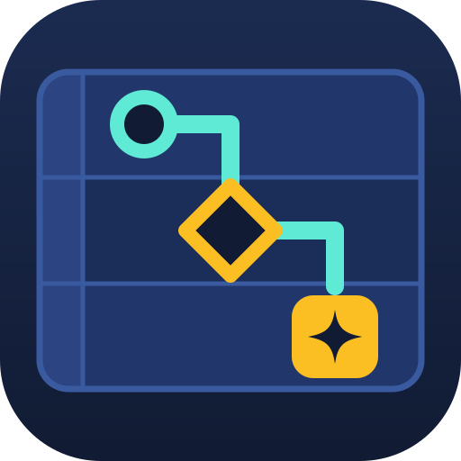
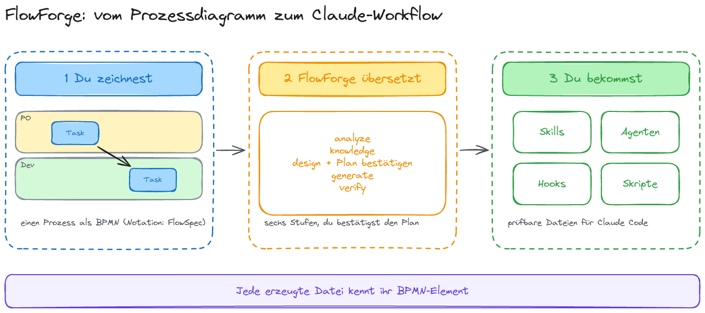
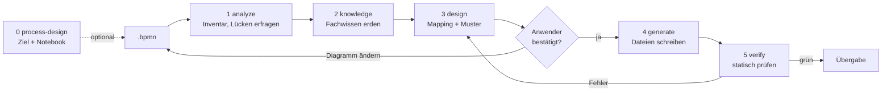
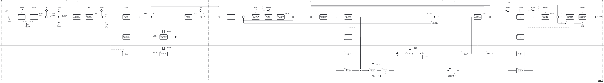

<p align="center"></p>

# FlowForge


**BPMN-2.0-Prozess rein, prüfbare Claude-Code-Artefakte raus.**

Ein Fachanwender zeichnet einen Prozess als BPMN-Diagramm (Lane = Rolle) oder lässt ihn aus seinem
Ziel und einem Notebook entwerfen. FlowForge übersetzt ihn
mit der `flowforge`-Pipeline in Agenten, Skills, Hooks, Skripte und genau einen Orchestrator
(Skill-Kette, Workflow-Skript oder Orchestrator-Agent). Jede erzeugte Datei verweist auf das
BPMN-Element, aus dem sie entstanden ist, und das wird in beide Richtungen geprüft.

**FlowSpec und FlowForge.** FlowSpec ist die Notation: ein BPMN-2.0-Profil, in dem Lane = Rolle,
`serviceTask` = KI, `userTask` = menschlicher Checkpoint ist ([`BPMN-NOTATION.md`](BPMN-NOTATION.md)).
FlowForge ist das Werkzeug, das FlowSpec-Diagramme in Claude-Code-Artefakte übersetzt.

- **Fachanwender führen, nicht YAML.** Jede Frage kommt als Auswahl mit Empfehlung, in der Sprache
  des Anwenders. Vor dem Erzeugen bestätigt der Anwender einen Mapping-Plan in Klartext.
- **Rückverfolgbar.** `bpmn: {file, elements}` in jeder Datei; `flowforge-verify` findet verwaiste
  Dateien genauso wie Elemente ohne Umsetzung.
- **Belegtes Wissen.** Fachwissen kommt aus NotebookLM-Notebooks, dem Web oder Repo-Dokumenten und
  ist mit Belegstellen versehen. Was keine Quelle hat, bleibt sichtbar `⚠ unverified`.
- **Nichts wird still umgebaut.** Passt das Diagramm nicht, geht die Frage an den Anwender zurück.
  Die Pipeline schreibt nur nach `generated/<workflow>/`, nie direkt nach `.claude/`.

Wer Agenten und Skills lieber von Hand schreibt, braucht dieses Repo nicht. Wie die Teile
zusammenspielen, steht in [`ARCHITECTURE.md`](ARCHITECTURE.md).

## Neu hier?

Sechs Skizzen erklären die Idee in etwa 15 Minuten, in dieser Reihenfolge
([Übersicht und Quelldateien](docs/erklaerung/README.md)):

| Skizze | Frage |
|---|---|
| [Problem](docs/erklaerung/00-problem.png) | Welches Problem lösen wir? |
| [Idee](docs/erklaerung/01-idee.png) | Was macht FlowForge? |
| [Bausteine](docs/erklaerung/03-bausteine.png) | Was sind Skill, Agent, Hook, Workflow und Kontext? |
| [Mapping](docs/erklaerung/05-mapping.png) | Was wird aus welchem BPMN-Element? |
| [Pipeline](docs/erklaerung/02-pipeline.png) | Wie läuft die Übersetzung ab, und wo entscheidest du? |
| [Kontext](docs/erklaerung/04-kontext.png) | Was sieht ein Schritt? |

[](docs/erklaerung/01-idee.png)

## Schnellstart

Das Repo ist Claude-Code-Plugin und Marketplace zugleich:

```text
/plugin marketplace add Cofinpro/FlowForge
/plugin install flowforge@flowforge
```

Dann Claude Code in dem Ordner starten, in dem das `.bpmn` liegt, und die Pipeline aufrufen:

```text
/flowforge:flowforge-run
```

oder einfach sagen: *„Mach aus meinem Prozessdiagramm einen Claude-Workflow.“* Das Ergebnis landet
unter `generated/<workflow>/`; installiert wird erst danach, auf Wunsch, mit einer Kopie von
`generated/<workflow>/.claude/` ins Projekt.

Ohne Installation aus einem Checkout ausprobieren: `claude --plugin-dir <pfad-zu-flowforge>`.

**Noch kein Diagramm?** `/flowforge:flowforge-model` fragt nach deinem Ziel, recherchiert den
Prozess im Notebook, lässt dich den Entwurf bestätigen und zeichnet ein `.bpmn`, das die Pipeline
ohne Rückfragen verarbeitet. Ein Diagramm von Hand zeichnen oder ändern: `/flowforge:bpmn-authoring`.

**Voraussetzungen:** `node`, `python3`, `xmllint`. Die npm-Pakete (`bpmn-moddle`, `bpmnlint`,
`js-yaml`, `ajv`, `playwright`) installieren die Skripte beim ersten Lauf nach
`~/.cache/bpmn-authoring-tools` (überschreibbar mit `BPMN_TOOLS_CACHE`), nie ins Projekt. Für
Notebook-Wissen optional der `gemini-notebook-mcp`-Server.

## Im eigenen Projekt nutzen

**Für das ganze Team einrichten.** Statt dass jeder das Plugin selbst installiert, kommt es in die
`.claude/settings.json` des Projekts:

```json
{
  "extraKnownMarketplaces": {
    "flowforge": { "source": { "source": "github", "repo": "Cofinpro/FlowForge" } }
  },
  "enabledPlugins": { "flowforge@flowforge": true }
}
```

Wer das Repo klont und Claude Code startet, bekommt das Plugin angeboten. Gleiches Ergebnis per
Kommandozeile: `claude plugin install flowforge@flowforge --scope project`. Ohne `--scope` gilt die
Installation nur für dich.

**Zugriff.** Claude Code holt das Plugin mit den eigenen Git-Zugangsdaten von GitHub. Ist das Repo
privat, braucht jeder im Team Lesezugriff auf `Cofinpro/FlowForge`.

**Aufrufen.** Skills und Agenten des Plugins tragen das Präfix `flowforge:`, z. B.
`/flowforge:flowforge-run` oder `/flowforge:bpmn-authoring`.

**Was im Projekt entsteht.** Ein Lauf schreibt nur nach `generated/<workflow>/`:

- `generated/<workflow>/.claude/` ist das Ergebnis zum Übernehmen. Installiert wird es erst, wenn
  ihr es kopiert: `cp -R generated/<workflow>/.claude/. .claude/`.
- `workflow-spec.yaml`, `mapping/` und `knowledge/` daneben halten fest, was aus jedem BPMN-Element
  wurde und warum. Empfehlung: `generated/` mit einchecken, dann bleiben die Entscheidungen
  nachvollziehbar, und ein neuer Lauf nach einer Diagrammänderung fragt nur nach dem Geänderten.

**Aktualisieren.** Neue Versionen kommen mit `/plugin marketplace update flowforge` (oder
automatisch, wenn Auto-Update für den Marketplace an ist), danach `/reload-plugins` oder eine neue
Sitzung. Es gibt nur dann ein Update, wenn die Version im Plugin gestiegen ist. Welche Version was
geändert hat, steht in den GitHub-Releases.

**Grenzen.** Die Wissensbasis `agentic-workflow-kb` ist im installierten Plugin schreibgeschützt;
neue Notebook-Antworten landen nur in einem Checkout dieses Repos. Das Fachwissen eines Laufs
(`generated/<workflow>/knowledge/`) liegt dagegen in eurem Projekt.

## So funktioniert es



| Stufe | Skill | Ergebnis |
|---|---|---|
| 0 | `flowforge-model` (optional) | `.bpmn` in FlowSpec-Notation, aus Ziel und Notebook entworfen |
| 1 | `flowforge-analyze` | `workflow-spec.yaml` als Entwurf; meldet nicht unterstützte Konstrukte mit Umbauvorschlag |
| 2 | `flowforge-knowledge` | belegtes Fachwissen je Lane/Aufgabe, offene Fragen an das Diagramm |
| 3 | `flowforge-design` | Entscheidung je Element, Orchestrierungsmuster, Rollen; Mapping-Plan zur Bestätigung |
| 4 | `flowforge-generate` | alle Dateien unter `generated/<workflow>/` |
| 5 | `flowforge-verify` | Bericht: Schema, Hash, Trace in beide Richtungen, Lint, keine offenen Punkte |

`flowforge-run` ist der Einstieg und führt die fünf Stufen samt Rücksprüngen; ohne
Diagramm startet er mit Stufe 0. Ändert sich das Diagramm später, fragt ein neuer Lauf nur nach
neuen oder geänderten Elementen.

Was aus welchem BPMN-Element wird, steht im nächsten Abschnitt.

## Vom BPMN-Element zum Skill, Agenten und Workflow

Die Pipeline liest ein Diagramm nach festen Regeln, den **Rubriken**. `mapping-rubric.md` entscheidet
je Element, was daraus wird; `pattern-rubric.md` wählt, wie die Teile zusammenspielen. Das Ergebnis
legt `flowforge-design` dir als Mapping-Plan zur Bestätigung vor, bevor etwas erzeugt wird.

### Was jedes Element bedeutet

| Du zeichnest | bedeutet im Prozess | wird zu |
|---|---|---|
| **Lane** | eine Rolle (PO, UX, Entwicklung, QA …) | eine Rolle; ein eigener Agent nur beim Muster Orchestrator-Agent, sonst eine Perspektive in den Skills |
| **Service Task** | Arbeit, die ein Agent erledigt | ein **Skill**, wenn der Schritt Vorlage, Checkliste oder Fachwissen braucht, wiederverwendet wird oder ein eigenes Artefakt liefert; sonst ein Schritt in einem Skill |
| **User Task** / **Manual Task** | ein Mensch entscheidet oder bestätigt | ein **Prüfpunkt**: der Ablauf hält an und fragt mit Optionen und Empfehlung |
| **Script Task** | deterministisch, gleiche Eingabe gibt immer das gleiche Ergebnis | ein **Skript** im Skill der Lane, eine Datei mit Node-Bordmitteln, ohne Installation |
| **Business Rule Task** | eine Prüfung gegen eine Regel | mechanische Regel (Schwelle, Pflichtfeld) → Skript; Prüfung mit Urteil (INVEST, Definition of Ready) → Checkliste im Skill; ein **Hook** nur, wenn ein Tool-Aufruf wirklich blockiert werden muss |
| **Task** ohne Typ | unklar | eine Rückfrage an dich; besser gleich typisieren |
| **Exklusives Gateway** | eine Entscheidung | eine Verzweigung im Ablauf; verlangt sie ein Urteil, schlägt der Ablauf den Zweig mit Begründung vor, Ausgänge und Rücksprünge bestätigst du |
| **Paralleles / inklusives Gateway** | mehrere Dinge gleichzeitig | parallele Schritte, im geführten Ablauf als getrennte Perspektiven nacheinander |
| **Schleife** (Rückfluss über ein Merge-Gateway) | Nacharbeit | eine Wiederholung mit Obergrenze (Standard 3); an der Grenze geht es mit Risikohinweis weiter oder der Ablauf fragt dich |
| **Start- / Endereignis** | Auslöser und Ergebnis | Einstieg bzw. Abschluss; ein vorzeitiges Ende hinterlässt eine Übergabenotiz |
| **Zugeklappter Teilprozess** / **Call Activity** | eine Phase mit eigenem Innenleben | ein wiederverwendbarer Skill oder ein eigener Teil-Workflow |
| **Mehrfachinstanz** | dasselbe je Element einer Menge | ein Schritt je Element, z. B. je Epic |
| **Datenobjekt** | ein Arbeitsergebnis | ein **Artefaktvertrag**: fester Ablageort und Kopfdaten (`status`, `version`), über die die Schritte sich übergeben und ein Lauf fortgesetzt werden kann |
| **Data Store** | ein dauerhafter Datenbestand (Handbuch, Tickets, Lernnotizen) | eine **Kontextquelle**, je nach `Art:` Wissensreferenz, Tool-Freigabe oder Gedächtnisdatei (siehe [Kontextquellen](#kontextquellen)) |
| **Fehler-Randereignis** | ein Fehlerpfad | ein Fehlerzweig in der Steuerlogik |

Noch nicht unterstützt: Pools mit Nachrichtenflüssen, Timer- und Nachrichtenereignisse,
Event-Teilprozesse, Kompensation. `flowforge-analyze` meldet sie und schlägt einen Umbau vor
(z. B. „bis zu 3 Versuche“ statt eines Timers). Bleibst du dabei, wird das Element eine bewusste,
grau markierte Lücke.

Alle Elemente mit Regeln, Kontextquellen, Farblegende und Checkliste auf einer Seite:
[`BPMN-NOTATION.md`](BPMN-NOTATION.md).

### Wie die Teile zusammenspielen

`pattern-rubric.md` zählt im Diagramm menschliche Aufgaben, Parallelität, Mehrfachinstanzen,
Schleifen und Entscheidungen, die ein Urteil verlangen, und wählt daraus ein Muster:

| Muster | passt, wenn | du bekommst |
|---|---|---|
| **Skill-Kette** | ein Mensch begleitet den Ablauf, der fast linear ist | einen Einstiegs-Skill, der die Schritte der Reihe nach aufruft und an den Prüfpunkten anhält |
| **Workflow-Skript** | der Ablauf läuft unbeaufsichtigt, mit echter Parallelität und klaren Regeln | ein Skript für das Workflow-Werkzeug von Claude Code; es startet nur, wenn du es startest |
| **Orchestrator-Agent** | Verzweigungen verlangen im Einzelfall ein Urteil, ohne dass ein Mensch dabei ist | einen koordinierenden Agenten, der Fall für Fall an Spezialisten-Agenten je Lane übergibt |
| **gemischt** | Phasen haben deutlich verschiedene Form | je Phase eines der drei Muster, mit klarer Übergabe |

Im Zweifel gewinnt das einfachere Muster.

### So zeichnest du, damit es gut wird

- **Lanes für Rollen**, und jedes Element in eine Lane.
- **Aufgaben typisieren**: Service, User, Script oder Business Rule Task statt eines leeren Tasks.
- **Gateways als Frage benennen** („Definition of Ready erfüllt?“) und jeden ausgehenden Fluss
  beschriften („Ja“, „Kriterien unklar“). Einen Standardfluss setzen, wenn es einen normalen Weg
  gibt.
- **Schleifen über ein eigenes Merge-Gateway** zurückführen.
- **`Input: … Output: …` in die Dokumentation** jeder Aufgabe schreiben und die wichtigen
  Arbeitsergebnisse als **Datenobjekte** einzeichnen. Daraus werden Eingaben, Ausgaben und
  Ablageorte.
- **Datenquellen als Data Store** einzeichnen, mit `Art:` und `Ort:` in der Dokumentation, und vor
  jedes Schreiben in ein Live-System einen User Task setzen.
- **Labels in deiner Sprache**: sie bleiben wörtlich erhalten und tauchen in den Skills wieder auf.

`flowforge-model` zeichnet nach genau diesen Regeln. `bpmn-authoring` hilft beim Zeichnen von
Hand und prüft gegen XSD, bpmn-moddle und bpmnlint. Die vollständigen Regeln stehen in
[`mapping-rubric.md`](.agents/skills/flowforge-design/references/mapping-rubric.md) und
[`pattern-rubric.md`](.agents/skills/flowforge-design/references/pattern-rubric.md), knapp
zusammengefasst in [`ARCHITECTURE.md`](ARCHITECTURE.md#übersetzungsregeln).

## Kontextquellen

Ein Schritt ist nur so gut wie die Daten, die er sieht. Zeichne deshalb jede dauerhafte Datenquelle
als **Data Store** und schreibe zwei Zeilen in seine Dokumentation: `Art:` (`wissen`, `live` oder
`gedächtnis`) und `Ort:` (`notebook:<Titel>`, `mcp:<Server>`, `cli:<Befehl>`, eine URL,
`datei:<Pfad>` oder `websearch`). Ob ein Schritt liest oder schreibt, sagt allein die Pfeilrichtung.
Die Pipeline macht daraus Wissensreferenzen, Tool-Freigaben, einen Schreibschutz und ein Gedächtnis
über Läufe hinweg. Fehlt eine Angabe, fragt sie nach, statt zu raten.

Beispiel aus der Fixture
[`context-flow.bpmn`](.agents/skills/flowforge-verify/fixtures/context-flow.bpmn):

| Data Store | `Art:` / `Ort:` | Pfeil | wird zu |
|---|---|---|---|
| Support-Handbuch | `wissen` / `notebook:Support-Handbuch` | → „Antwort entwerfen“ | belegte Referenz im Skill des Schritts |
| Jira-Tickets Projekt LANE | `live` / `mcp:atlassian` | → „Ticket analysieren“, „Kommentar im Ticket posten“ → | Lese-Tools in der Allowlist; Schreib-Tool nur hinter dem User Task „Antwort freigeben“ und einem `ask`-Hook |
| Lernnotizen Support | `gedächtnis` / `datei:.claude/memory/context-flow/lernnotizen-support.md` | → „Ticket analysieren“, „Lernnotiz fortschreiben“ → | kuratierte Datei, höchstens 150 Zeilen, mit Cap-Hook |

Das prozessweite Eingangsdatum „Ticket-ID“ wird zum `argument-hint` des erzeugten Orchestrators.
Schreibt ein Schritt in einen Live-Store, ohne dass auf jedem Pfad ein User Task davorliegt, meldet
`flowforge-verify` einen Fehler (Gegenprobe: `context-flow-unguarded.bpmn`). Notation, Regeln und
was bewusst fehlt: [`ARCHITECTURE.md`](ARCHITECTURE.md#kontextquellen).

## Fachwissen aus Gemini-Notebooks

Ein Skill ist nur so gut wie das Fachwissen darin. Schreibt das Modell eine INVEST-Checkliste oder
die Kriterien für eine Definition of Ready aus dem Gedächtnis, klingt das plausibel, kann aber
erfunden, veraltet oder nicht eure Praxis sein. FlowForge holt dieses Wissen deshalb aus einem
**NotebookLM-Notebook mit Quellen, die ihr selbst ausgewählt und geprüft habt**: Fachbücher,
Handbücher, euer Fachkonzept, Prozessregeln. Das Notebook antwortet nur aus diesen Quellen und nennt
zu jeder Aussage die Textstelle.

### Einrichten

1. In [NotebookLM](https://notebooklm.google.com) ein Notebook anlegen und die Quellen hochladen,
   die für den Prozess gelten sollen. Weniger, dafür passende Quellen sind besser als viele.
2. In Claude Code den MCP-Server `gemini-notebook-mcp` einrichten und einmal `nlm login` im
   Terminal ausführen.
3. Ohne Diagramm: `flowforge-model` entwirft den Prozess aus dem Notebook.
4. Die Pipeline starten. In Stufe 2 (`flowforge-knowledge`) zeigt sie eure Notebooks zur Auswahl
   und fragt, welches Notebook welche Lanes oder Aufgaben abdeckt. Mehrere Notebooks gehen auch,
   z. B. eines je Fachbereich.

### Was mit dem Notebook passiert

- **Der Prozess wird entworfen** (nur mit `flowforge-model`). Phasen, Rollen, Prüfpunkte und
  Übergaben kommen aus dem Notebook; jede Aufgabe nennt ihre Quelle, Schritte ohne Beleg sind
  `⚠ unverified`.
- **Das Diagramm wird gegengeprüft.** Je Phase fragt die Pipeline das Notebook, welche Schritte,
  Prüfungen oder Rollen die Quellen kennen, die im Diagramm fehlen. Jeder Befund wird zu einer Frage
  an dich. Das Diagramm oder die Planung ändert sich nur, wenn du zustimmst.
- **Das Wissen wird destilliert.** Je Phase oder Aufgabe entsteht eine kurze Datei unter
  `generated/<workflow>/knowledge/`: Vorgehen, Kriterien, Fallstricke, Begriffe. Jede Aussage trägt
  einen Verweis wie `[refinement-1: 26, 27]`, also FAQ-Eintrag und Belegnummern. Diese Dateien
  landen als `references/` in den erzeugten Skills.
- **Jede Antwort wird aufbewahrt.** `generated/<workflow>/knowledge/faq/` enthält jede Frage an das
  Notebook im Wortlaut, die Antwort unverändert und zu jeder Belegnummer Quelle und zitierte
  Textstelle. Ein späterer Lauf, auch Stufe 2 nach `flowforge-model`, schaut dort zuerst
  nach und fragt das Notebook nur, was noch fehlt.

### Belegstufen

| Stufe | Bedeutung |
|---|---|
| `cited` | Aussage mit Beleg aus dem Notebook, dem Web oder einem geprüften Dokument im Repo |
| `inferred` | aus belegtem Material oder dem Diagramm abgeleitet, ohne eigene Quelle |
| `unverified` | nur Modellwissen; im Text sichtbar als `⚠ unverified` markiert |

Ohne Notebook bietet die Pipeline Websuche mit Quellenangabe, vorhandene geprüfte Dokumente im
Repo oder Modellwissen an. Letzteres bleibt als `unverified` markiert und wird nie nachträglich
hochgestuft.

**Grenze:** Das Notebook antwortet nur aus euren Quellen, aber seine Zusammenfassung kann eine
Quelle trotzdem falsch wiedergeben. Für Aussagen, auf die es ankommt, die zitierte Textstelle im
FAQ lesen, nicht nur den zusammengefassten Satz. Genau dafür ist sie dort.

Beispiel: [`examples/user-story-refinement/`](examples/user-story-refinement/) ist mit dem Notebook
„The Product – Business Design“ (26 Quellen) gelaufen: sechs Fragen im FAQ, sechs Wissensdateien,
vier Befunde, die als Fragen an den Anwender gingen.

Nicht verwechseln mit der [Wissensbasis](#wissensbasis) weiter unten: Die gehört der Pipeline selbst
und beantwortet Fragen dazu, wie man Agenten und Skills baut, nicht zu eurem Fachgebiet.

## Was herauskommt

```text
generated/<workflow>/
  .claude/                   # alles, was installiert wird, im Aufbau eines Projekt-.claude/
    agents/  skills/         #   die Artefakte
    hooks/  settings.json    #   Kostenprotokoll immer, Write-Guard/Memory-Cap bei Stores; settings.json meldet jeden Hook an
    workflows/               #   nur beim Muster Workflow-Skript
  README.md                  # Installation in einer Zeile, für den Anwender
  workflow-spec.yaml         # die Spezifikation, über die alle Stufen reden
  knowledge/                 # destilliertes Fachwissen + FAQ mit Belegstellen
  mapping/                   # report.md, farbiges workflow-mapped.bpmn, index.html, PNGs
```

Installiert wird mit einer Kopie: `cp -R generated/<workflow>/.claude/. <projekt>/.claude/`. Kein
Installationsskript, kein `npm install`: Skripte gibt es nur für echte `scriptTask`s, mechanische
Regeln und Hooks, jeweils eine Datei mit Node-Bordmitteln. Das Beispiel `dark-factory` ist noch im
alten Aufbau (ohne `.claude/`, Hooks als einzelne Snippets); `verify.mjs` prüft beide.

Die Mapping-Ansicht (`mapping/index.html`) färbt jedes BPMN-Element nach Ergebnis und verlinkt es mit
seiner Datei.

## Was hat ein Lauf gekostet?

Jeder erzeugte Workflow bringt ein Kostenprotokoll mit: Ein Hook schreibt nach jedem Lauf die
verbrauchten Tokens in `.claude/runs/<workflow>/ledger.jsonl` (ohne Preise, ohne Netz; nimm
`.claude/runs/` in die `.gitignore` auf). Mit dem FlowForge-Plugin rechnet der Skill
`flowforge-cost` daraus die Kosten je BPMN-Element, Lane und Phase und gleicht die Summe mit der
Session ab:

```text
/flowforge:flowforge-cost
```

Das Ergebnis ist `cost.md` neben dem Protokoll. In der Mapping-Ansicht erscheinen die Kosten als
Badge am Element (`render-mapping.mjs … --cost cost.json`). Für belastbare Zahlen wiederholt
`cost-bench.mjs` denselben Lauf mehrfach und nennt Median und Streuung je Element; jeder Lauf kostet
echtes Geld, deshalb braucht er ein ausdrückliches `--confirm`. Voraussetzung ist, dass jeder
Agentenaufruf mit der Element-ID beginnt; das erzeugt `flowforge-generate` und prüft `verify`. Wie
das funktioniert und wo die Grenzen liegen: [`ARCHITECTURE.md`](ARCHITECTURE.md#laufkosten).

## Beispiele

**[`examples/dark-factory/`](examples/dark-factory/)**: „Von der Produktvision zu User Stories“. Ein
großer Prozess mit Teilprozessen, einmal komplett durch die Pipeline gelaufen: 10 Agenten, 58
Skills, 3 Hooks und ein Workflow-Skript unter
[`generated/product-vision-to-user-stories/`](examples/dark-factory/generated/product-vision-to-user-stories/).
Das ist ein Schnappschuss; das daraus entstandene Dark-Factory-Plugin wird im Repo
`ai-sdlc-dojo-2026-factory` von Hand weitergepflegt.

**[`examples/user-story-refinement/`](examples/user-story-refinement/)**: eine neue User Story aus
Feedback erstellen und verfeinern. Ein Diagramm mit vier Lanes und sechs Phasen, als erstes Beispiel
im neuen Aufbau durch die Pipeline gelaufen: 8 Skills, ein Write-Guard-Hook und eine `settings.json` unter
[`generated/user-story-refinement/.claude/`](examples/user-story-refinement/generated/user-story-refinement/.claude/),
installierbar mit einer Kopie, ohne Agenten und Skripte. Es zeigt zwei der drei Kontextquellen-Arten im
Einsatz: Notebook-Wissen je Phase und das Product Backlog live in GitHub (`cli:gh`), das
nur nach einer Freigabe direkt davor geschrieben wird.



**[`examples/flowforge/`](examples/flowforge/)**: FlowForge selbst als BPMN. Sechs Lanes von der
Prozessmodellierung bis zu Prüfung & Übergabe, sieben menschliche Prüfpunkte, beide Schleifen der
Pipeline und neun Data Stores aller drei Arten. Bisher nur gezeichnet, nicht durch die Pipeline
gelaufen.

## Inhalt des Repos

```text
.agents/skills/                       # Skills (echte Dateien); .claude/skills/<name> sind Symlinks
  flowforge-run            #   Einstieg: führt die Pipeline Ende-zu-Ende
  flowforge-analyze … -verify        #   die fünf Stufen (siehe oben)
  flowforge-cost                     #   nach einem Lauf: Kosten je BPMN-Element, Lane und Phase
  flowforge-model                 #   Prozess aus Ziel + Notebook entwerfen und als pipeline-taugliches BPMN zeichnen
  bpmn-authoring                      #   BPMN von Hand schreiben: XSD, bpmn-moddle, bpmnlint, Layout
  agentic-workflow-kb                 #   Wissensbasis Agentic Design: FAQ + Referenzen mit Belegstellen
  orchestration-design                #   Orchestrierung prüfen (Übergaben, Prüfpunkte, Schleifen)
  agent-authoring                     #   Agenten schneiden, schreiben, reviewen
  skill-authoring                     #   Skills schreiben und reviewen
  trim-the-fat                        #   Skills kürzen, ohne ihr Verhalten zu ändern (nur per /trim-the-fat)
.agents/agents/                       # Agenten (echte Dateien); .claude/agents/<name>.md sind Symlinks
  agentic-kb-librarian                #   beantwortet Designfragen aus der Wissensbasis, fragt sonst das Notebook
  agentic-workflow-architect          #   prüft den Spec-Entwurf vor dem Mapping-Plan (nur lesend)
  agentic-artifact-reviewer           #   prüft erzeugte Skills/Agenten auf Qualität (nur lesend)
.claude-plugin/                       # plugin.json + marketplace.json
examples/                             # siehe oben
```

## Wissensbasis

`agentic-workflow-kb` enthält das Wissen aus dem NotebookLM-Notebook **„Agentic Workflows“**
(11 Quellen: O'Reilly-Bücher zu Agenten, Claude-Doku zu Skills und Kontextfenstern, Leitfäden zu
Claude-Code-Workflows) offline, in drei Schichten, billigste zuerst:

1. `faq/`: jede Frage an das Notebook im Wortlaut, die Antwort unverändert, jede Belegnummer auf
   Quelle und Textstelle aufgelöst. Index: `faq/README.md`.
2. `references/`: kurze Leitlinien je Thema; jede Aussage trägt einen Verweis wie
   `[agent-design-1: 3, 5]` (FAQ-Eintrag, Belegnummern).
3. das Notebook selbst, nur wenn 1 und 2 nichts hergeben.

Neue Antworten mit `.agents/skills/flowforge-knowledge/scripts/notebook-faq.py add` ins FAQ
aufnehmen, dann findet sie der nächste Lauf. `flowforge-knowledge` legt nach demselben Muster je
Workflow ein FAQ unter `generated/<workflow>/knowledge/faq/` an. Im installierten Plugin ist die
Wissensbasis schreibgeschützt; neue Einträge entstehen nur in einem Checkout dieses Repos.

## Mitentwickeln

Das Plugin braucht keinen Build: `.claude-plugin/plugin.json` zeigt direkt auf `.agents/skills/` und
`.agents/agents/`. Pfade zwischen Skills stehen als `${CLAUDE_SKILL_DIR}/../<skill>/…` und
funktionieren so im Repo wie im installierten Plugin. Agenten laden ihre Skills über `skills:` im
Frontmatter. Ein neuer Agent muss in die `agents`-Liste von `plugin.json`. Weitere Regeln stehen in
[`CLAUDE.md`](CLAUDE.md).

```bash
npm install          # Dev-Tools (release-it, commitlint, husky), richtet den commit-msg-Hook ein
npm run validate     # claude plugin validate .
```

Commit-Nachrichten folgen den [Conventional Commits](https://www.conventionalcommits.org/)
(`feat: …`, `fix: …`, `docs: …`, `chore: …`); der `commit-msg`-Hook lehnt andere ab.

### Fallbeispiel neu erzeugen

`examples/dark-factory/generated/` nie von Hand ändern. Stattdessen die Generator-Quellen in
`examples/dark-factory/tools/dark-factory-gen/` anpassen und neu erzeugen:

```bash
bash examples/dark-factory/tools/dark-factory-gen/regenerate.sh
```

Muss mit `RESULT: PASS`, `no reference problems`, `smoke test ok`, `story smoke ok`,
`research smoke ok` und `mapping view ok` enden. Details:
[`tools/dark-factory-gen/README.md`](examples/dark-factory/tools/dark-factory-gen/README.md).

### Release

- **CI** (`.github/workflows/ci.yml`): bei jedem Push auf `main` und jedem PR wird das Plugin
  validiert; bei PRs werden zusätzlich die Commit-Nachrichten geprüft.
- **Release** (`.github/workflows/release.yml`): automatisch bei jedem Push auf `main`, sofern seit
  dem letzten Tag ein `feat:`, `fix:` oder Breaking Change dazukam; reine `docs:`/`chore:`-Merges
  lösen keins aus. Von Hand unter *Actions → Release → Run workflow*, nur auf `main`, dort ist die
  Erhöhung wählbar: `auto` (aus den Commits: `feat:` → minor, `fix:` → patch,
  `feat!:`/`BREAKING CHANGE:` → major) oder fest `patch`/`minor`/`major`, optional als Probelauf.
  Der Workflow setzt die Version in `plugin.json` und `package.json`, schreibt `CHANGELOG.md`, taggt
  `vX.Y.Z` und legt das GitHub-Release an.

Nutzer bekommen Updates nur, wenn die Version in `plugin.json` steigt. Deshalb läuft jede
Auslieferung über den Release-Workflow (lokal geht auch `npm run release`). Pusht der Workflow nicht
auf `main` (Branch-Schutz), braucht der Bot dort eine Ausnahme.
