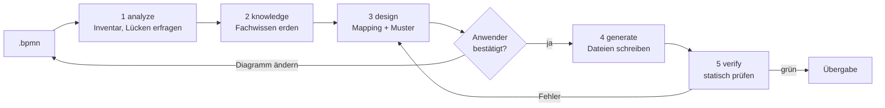

# lanecraft

**BPMN-2.0-Prozess rein, prüfbare Claude-Code-Artefakte raus.**

Ein Fachanwender zeichnet einen Prozess als BPMN-Diagramm (Lane = Rolle). lanecraft übersetzt ihn
mit der `bpmn2agent`-Pipeline in Agenten, Skills, Hooks, Skripte und genau einen Orchestrator
(Skill-Kette, Workflow-Skript oder Orchestrator-Agent). Jede erzeugte Datei verweist auf das
BPMN-Element, aus dem sie entstanden ist, und das wird in beide Richtungen geprüft.

- **Fachanwender führen, nicht YAML.** Jede Frage kommt als Auswahl mit Empfehlung, in der Sprache
  des Anwenders. Vor dem Erzeugen bestätigt der Anwender einen Mapping-Plan in Klartext.
- **Rückverfolgbar.** `bpmn: {file, elements}` in jeder Datei; `bpmn2agent-verify` findet verwaiste
  Dateien genauso wie Elemente ohne Umsetzung.
- **Belegtes Wissen.** Fachwissen kommt aus NotebookLM-Notebooks, dem Web oder Repo-Dokumenten und
  ist mit Belegstellen versehen. Was keine Quelle hat, bleibt sichtbar `⚠ unverified`.
- **Nichts wird still umgebaut.** Passt das Diagramm nicht, geht die Frage an den Anwender zurück.
  Die Pipeline schreibt nur nach `generated/<workflow>/`, nie direkt nach `.claude/`.

Wer Agenten und Skills lieber von Hand schreibt, braucht dieses Repo nicht. Wie die Teile
zusammenspielen, steht in [`ARCHITECTURE.md`](ARCHITECTURE.md).

## Schnellstart

Das Repo ist Claude-Code-Plugin und Marketplace zugleich:

```text
/plugin marketplace add Cofinpro/lanecraft
/plugin install lanecraft@lanecraft
```

Dann Claude Code in dem Ordner starten, in dem das `.bpmn` liegt, und die Pipeline aufrufen:

```text
/lanecraft:bpmn-to-agentic-workflow
```

oder einfach sagen: *„Mach aus meinem Prozessdiagramm einen Claude-Workflow.“* Das Ergebnis landet
unter `generated/<workflow>/`; installiert wird erst danach, auf Wunsch, mit einer Kopie von
`generated/<workflow>/.claude/` ins Projekt.

Ohne Installation aus einem Checkout ausprobieren: `claude --plugin-dir <pfad-zu-lanecraft>`.
Noch kein Diagramm? `bpmn-authoring` hilft beim Zeichnen eines gültigen, sauber gelayouteten `.bpmn`.

**Voraussetzungen:** `node`, `python3`, `xmllint`. Die npm-Pakete (`bpmn-moddle`, `bpmnlint`,
`js-yaml`, `ajv`, `playwright`) installieren die Skripte beim ersten Lauf nach
`~/.cache/bpmn-authoring-tools` (überschreibbar mit `BPMN_TOOLS_CACHE`), nie ins Projekt. Für
Notebook-Wissen optional der `gemini-notebook-mcp`-Server.

## Im eigenen Projekt nutzen

**Für das ganze Team einrichten.** Statt dass jeder das Plugin selbst installiert, kommt es in die
`.claude/settings.json` des Projekts:

```json
{
  "extraKnownMarketplaces": {
    "lanecraft": { "source": { "source": "github", "repo": "Cofinpro/lanecraft" } }
  },
  "enabledPlugins": { "lanecraft@lanecraft": true }
}
```

Wer das Repo klont und Claude Code startet, bekommt das Plugin angeboten. Gleiches Ergebnis per
Kommandozeile: `claude plugin install lanecraft@lanecraft --scope project`. Ohne `--scope` gilt die
Installation nur für dich.

**Zugriff.** Claude Code holt das Plugin mit den eigenen Git-Zugangsdaten von GitHub. Ist das Repo
privat, braucht jeder im Team Lesezugriff auf `Cofinpro/lanecraft`.

**Aufrufen.** Skills und Agenten des Plugins tragen das Präfix `lanecraft:`, z. B.
`/lanecraft:bpmn-to-agentic-workflow` oder `/lanecraft:bpmn-authoring`.

**Was im Projekt entsteht.** Ein Lauf schreibt nur nach `generated/<workflow>/`:

- `generated/<workflow>/.claude/` ist das Ergebnis zum Übernehmen. Installiert wird es erst, wenn
  ihr es kopiert: `cp -R generated/<workflow>/.claude/. .claude/`.
- `workflow-spec.yaml`, `mapping/` und `knowledge/` daneben halten fest, was aus jedem BPMN-Element
  wurde und warum. Empfehlung: `generated/` mit einchecken, dann bleiben die Entscheidungen
  nachvollziehbar, und ein neuer Lauf nach einer Diagrammänderung fragt nur nach dem Geänderten.

**Aktualisieren.** Neue Versionen kommen mit `/plugin marketplace update lanecraft` (oder
automatisch, wenn Auto-Update für den Marketplace an ist), danach `/reload-plugins` oder eine neue
Sitzung. Es gibt nur dann ein Update, wenn die Version im Plugin gestiegen ist. Welche Version was
geändert hat, steht in den GitHub-Releases.

**Grenzen.** Die Wissensbasis `agentic-workflow-kb` ist im installierten Plugin schreibgeschützt;
neue Notebook-Antworten landen nur in einem Checkout dieses Repos. Das Fachwissen eines Laufs
(`generated/<workflow>/knowledge/`) liegt dagegen in eurem Projekt.

## So funktioniert es



| Stufe | Skill | Ergebnis |
|---|---|---|
| 1 | `bpmn2agent-analyze` | `workflow-spec.yaml` als Entwurf; meldet nicht unterstützte Konstrukte mit Umbauvorschlag |
| 2 | `bpmn2agent-knowledge` | belegtes Fachwissen je Lane/Aufgabe, offene Fragen an das Diagramm |
| 3 | `bpmn2agent-design` | Entscheidung je Element, Orchestrierungsmuster, Rollen; Mapping-Plan zur Bestätigung |
| 4 | `bpmn2agent-generate` | alle Dateien unter `generated/<workflow>/` |
| 5 | `bpmn2agent-verify` | Bericht: Schema, Hash, Trace in beide Richtungen, Lint, keine offenen Punkte |

`bpmn-to-agentic-workflow` ist der Einstieg und führt die fünf Stufen samt Rücksprüngen. Ändert sich
das Diagramm später, fragt ein neuer Lauf nur nach neuen oder geänderten Elementen.

Grob übersetzt: Lane → Agent, `serviceTask` → Skill, `userTask` → menschlicher Prüfpunkt,
`scriptTask`/mechanische Regel → Skript, Prüfung mit Urteil (INVEST, DoR) → Skill-Text, Hook nur, wenn
ein Tool-Aufruf wirklich blockiert werden muss,
Gateways und Schleifen → Steuerlogik mit Obergrenze, Datenobjekt → Artefaktvertrag. Die vollständigen
Regeln stehen in [`ARCHITECTURE.md`](ARCHITECTURE.md#übersetzungsregeln).

## Was herauskommt

```text
generated/<workflow>/
  .claude/                   # alles, was installiert wird, im Aufbau eines Projekt-.claude/
    agents/  skills/         #   die Artefakte
    hooks/  settings.json    #   nur bei Hooks; settings.json meldet jeden Hook an
    workflows/               #   nur beim Muster Workflow-Skript
  README.md                  # Installation in einer Zeile, für den Anwender
  workflow-spec.yaml         # die Spezifikation, über die alle Stufen reden
  knowledge/                 # destilliertes Fachwissen + FAQ mit Belegstellen
  mapping/                   # report.md, farbiges workflow-mapped.bpmn, index.html, PNGs
```

Installiert wird mit einer Kopie: `cp -R generated/<workflow>/.claude/. <projekt>/.claude/`. Kein
Installationsskript, kein `npm install`: Skripte gibt es nur für echte `scriptTask`s, mechanische
Regeln und Hooks, jeweils eine Datei mit Node-Bordmitteln. Das Beispiel `dark-factory` ist noch im
alten Aufbau (ohne `.claude/`, Hooks als einzelne Snippets); `verify.mjs` prüft beide.

Die Mapping-Ansicht (`mapping/index.html`) färbt jedes BPMN-Element nach Ergebnis und verlinkt es mit
seiner Datei.

## Beispiele

**[`examples/dark-factory/`](examples/dark-factory/)**: „Von der Produktvision zu User Stories“. Ein
großer Prozess mit Teilprozessen, einmal komplett durch die Pipeline gelaufen: 10 Agenten, 58
Skills, 3 Hooks und ein Workflow-Skript unter
[`generated/product-vision-to-user-stories/`](examples/dark-factory/generated/product-vision-to-user-stories/).
Das ist ein Schnappschuss; das daraus entstandene Dark-Factory-Plugin wird im Repo
`ai-sdlc-dojo-2026-factory` von Hand weitergepflegt.

**[`examples/user-story-refinement/`](examples/user-story-refinement/)**: eine neue User Story aus
Feedback erstellen und verfeinern. Ein Diagramm mit vier Lanes und sechs Phasen, als erstes Beispiel
im neuen Aufbau durch die Pipeline gelaufen: 7 Skills unter
[`generated/user-story-refinement/.claude/`](examples/user-story-refinement/generated/user-story-refinement/.claude/),
installierbar mit einer Kopie, ohne Agenten, Skripte und Hooks.


## Inhalt des Repos

```text
.agents/skills/                       # Skills (echte Dateien); .claude/skills/<name> sind Symlinks
  bpmn-to-agentic-workflow            #   Einstieg: führt die Pipeline Ende-zu-Ende
  bpmn2agent-analyze … -verify        #   die fünf Stufen (siehe oben)
  bpmn-authoring                      #   BPMN von Hand schreiben: XSD, bpmn-moddle, bpmnlint, Layout
  agentic-workflow-kb                 #   Wissensbasis Agentic Design: FAQ + Referenzen mit Belegstellen
  orchestration-design                #   Orchestrierung prüfen (Übergaben, Prüfpunkte, Schleifen)
  agent-authoring                     #   Agenten schneiden, schreiben, reviewen
  skill-authoring                     #   Skills schreiben und reviewen
  trim-the-fat                        #   Skills kürzen, ohne ihr Verhalten zu ändern (nur per /trim-the-fat)
.agents/agents/                       # Agenten (echte Dateien); .claude/agents/<name>.md sind Symlinks
  agentic-kb-librarian                #   beantwortet Designfragen aus der Wissensbasis, fragt sonst das Notebook
  agentic-workflow-architect          #   prüft den Spec-Entwurf vor dem Mapping-Plan (nur lesend)
  agentic-artifact-reviewer           #   prüft erzeugte Skills/Agenten auf Qualität (nur lesend)
.claude-plugin/                       # plugin.json + marketplace.json
examples/                             # siehe oben
```

## Wissensbasis

`agentic-workflow-kb` enthält das Wissen aus dem NotebookLM-Notebook **„Agentic Workflows“**
(11 Quellen: O'Reilly-Bücher zu Agenten, Claude-Doku zu Skills und Kontextfenstern, Leitfäden zu
Claude-Code-Workflows) offline, in drei Schichten, billigste zuerst:

1. `faq/`: jede Frage an das Notebook im Wortlaut, die Antwort unverändert, jede Belegnummer auf
   Quelle und Textstelle aufgelöst. Index: `faq/README.md`.
2. `references/`: kurze Leitlinien je Thema; jede Aussage trägt einen Verweis wie
   `[agent-design-1: 3, 5]` (FAQ-Eintrag, Belegnummern).
3. das Notebook selbst, nur wenn 1 und 2 nichts hergeben.

Neue Antworten mit `.agents/skills/bpmn2agent-knowledge/scripts/notebook-faq.py add` ins FAQ
aufnehmen, dann findet sie der nächste Lauf. `bpmn2agent-knowledge` legt nach demselben Muster je
Workflow ein FAQ unter `generated/<workflow>/knowledge/faq/` an. Im installierten Plugin ist die
Wissensbasis schreibgeschützt; neue Einträge entstehen nur in einem Checkout dieses Repos.

## Mitentwickeln

Das Plugin braucht keinen Build: `.claude-plugin/plugin.json` zeigt direkt auf `.agents/skills/` und
`.agents/agents/`. Pfade zwischen Skills stehen als `${CLAUDE_SKILL_DIR}/../<skill>/…` und
funktionieren so im Repo wie im installierten Plugin. Agenten laden ihre Skills über `skills:` im
Frontmatter. Ein neuer Agent muss in die `agents`-Liste von `plugin.json`. Weitere Regeln stehen in
[`CLAUDE.md`](CLAUDE.md).

```bash
npm install          # Dev-Tools (release-it, commitlint, husky), richtet den commit-msg-Hook ein
npm run validate     # claude plugin validate .
```

Commit-Nachrichten folgen den [Conventional Commits](https://www.conventionalcommits.org/)
(`feat: …`, `fix: …`, `docs: …`, `chore: …`); der `commit-msg`-Hook lehnt andere ab.

### Fallbeispiel neu erzeugen

`examples/dark-factory/generated/` nie von Hand ändern. Stattdessen die Generator-Quellen in
`examples/dark-factory/tools/dark-factory-gen/` anpassen und neu erzeugen:

```bash
bash examples/dark-factory/tools/dark-factory-gen/regenerate.sh
```

Muss mit `RESULT: PASS`, `no reference problems`, `smoke test ok`, `story smoke ok`,
`research smoke ok` und `mapping view ok` enden. Details:
[`tools/dark-factory-gen/README.md`](examples/dark-factory/tools/dark-factory-gen/README.md).

### Release

- **CI** (`.github/workflows/ci.yml`): bei jedem Push auf `main` und jedem PR wird das Plugin
  validiert; bei PRs werden zusätzlich die Commit-Nachrichten geprüft.
- **Release** (`.github/workflows/release.yml`): von Hand unter *Actions → Release → Run workflow*,
  nur auf `main`. Die Erhöhung ist `auto` (aus den Commits: `feat:` → minor, `fix:` → patch,
  `feat!:`/`BREAKING CHANGE:` → major) oder fest `patch`/`minor`/`major`, optional als Probelauf.
  Der Workflow setzt die Version in `plugin.json` und `package.json`, schreibt `CHANGELOG.md`, taggt
  `vX.Y.Z` und legt das GitHub-Release an.

Nutzer bekommen Updates nur, wenn die Version in `plugin.json` steigt. Deshalb läuft jede
Auslieferung über den Release-Workflow (lokal geht auch `npm run release`).
