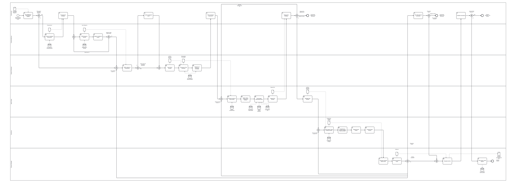

# Beispiel: lanecraft als BPMN

Der Ablauf dieses Repos, in seiner eigenen Notation gezeichnet: Ein Fachanwender bringt ein Ziel
oder ein fertiges BPMN-Diagramm mit. Ohne Diagramm entwirft `bpmn-process-design` den Prozess aus
Notebook-Wissen. Danach übersetzen die fünf Stufen `bpmn2agent-analyze`, `-knowledge`, `-design`,
`-generate` und `-verify` ihn über die `workflow-spec.yaml` in Agenten, Skills, Hooks, Skripte und
genau eine Orchestrierungsdatei unter `generated/<workflow>/`. Am Ende steht der übergebene oder
installierte Workflow.

Das Diagramm beschreibt den Ablauf, wie `ARCHITECTURE.md` und die Stufen-Skills ihn festlegen. Es
ist noch nicht durch die Pipeline gelaufen; es gibt also kein `generated/`.



## Aufbau

- **Eine Ebene, sechs Lanes** (Lane = Rolle):

| Lane | Teil von lanecraft |
|---|---|
| Fachanwender | Intake und alle menschlichen Entscheidungen |
| Prozessmodellierung | `bpmn-process-design`, `bpmn-authoring` (nur ohne vorhandenes Diagramm) |
| Analyse & Fachwissen | `bpmn2agent-analyze`, `bpmn2agent-knowledge` |
| Agentic Design | `bpmn2agent-design` mit den Agenten `agentic-workflow-architect` und `agentic-kb-librarian` |
| Generierung | `bpmn2agent-generate` mit dem Agenten `agentic-artifact-reviewer` |
| Prüfung & Übergabe | `bpmn2agent-verify`, Übergabebericht, Installation |

- **Aufgabentypen**: `serviceTask` = KI-Arbeit, `userTask` = menschlicher Prüfpunkt, `scriptTask`
  = Skript (`validate.sh`/`render.mjs`, `inventory.mjs`, `render-mapping.mjs`, `verify.mjs`, die
  Kopie nach `.claude/`).
- **Sieben Prüfpunkte**: Ziel, Diagramm & Wissensquellen angeben · Prozessentwurf bestätigen ·
  Lücken im Diagramm klären · Offene Fachfragen beantworten · Mapping-Plan bestätigen · Über offene
  Befunde entscheiden · Installation entscheiden.
- **Schleifen** mit Obergrenze am Rückweg:

| Schleife | Rückweg | Ausweg |
|---|---|---|
| Diagramm gültig & agent-ready? | zurück zum Zeichnen (max. 3×) | weiter mit Risikohinweis |
| Mapping-Plan angenommen? | Elemente anpassen (max. 3×) | Diagramm ändern → Lauf endet (Schleife A) |
| Prüfung bestanden? | je nach Befund zurück zu Analyse, Design oder Generierung (max. 3×) | Obergrenze erreicht → als unverifiziert übergeben oder Diagramm ändern |

- **Acht Datenobjekte** tragen die Übergaben zwischen den Lanes: Prozessentwurf → `.bpmn`-Diagramm →
  `workflow-spec.yaml` (Entwurf) → Wissenspaket (`knowledge/`) → Mapping-Plan →
  `workflow-spec.yaml` (bestätigt) → Claude-Code-Artefakte (`.claude/`) → Prüfbericht.
- **Prozess-Ein- und -Ausgabe** als `ioSpecification`: *Prozessziel oder BPMN-Diagramm* hinein,
  *Generierter Workflow (`generated/<workflow>/`)* heraus.
- **Neun Data Stores**:

| Store | Art | Ort | Pfeile |
|---|---|---|---|
| Fach-Notebooks: Prozessrecherche | live | `mcp:gemini-notebook-mcp` | → Prozess im Notebook recherchieren |
| Fach-Notebooks: Wissensextraktion | live | `mcp:gemini-notebook-mcp` | → Fachwissen je Task extrahieren, Diagramm mit Fachwissen hinterfragen |
| BPMN-Notation lanecraft | wissen | `datei:BPMN-NOTATION.md` | → BPMN-Diagramm zeichnen |
| Mapping- & Muster-Rubrik | wissen | `datei:.agents/skills/bpmn2agent-design/references/` | → Elemente zuordnen & Muster wählen |
| Agentic-Design-Wissensbasis | wissen | `datei:.agents/skills/agentic-workflow-kb/references/` | → Entwurf gegen Wissensbasis prüfen |
| Notebook „Agentic Workflows“ | live | `mcp:gemini-notebook-mcp` | → Entwurf gegen Wissensbasis prüfen |
| Agentic-Design-FAQ | gedächtnis | `datei:.agents/skills/agentic-workflow-kb/faq/` | ↔ Entwurf gegen Wissensbasis prüfen |
| Generierungs-Vorlagen | wissen | `datei:.agents/skills/bpmn2agent-generate/assets/templates/` | → Skills, Agenten, Hooks & Skripte schreiben |
| Claude-Projekt des Anwenders | live | `datei:<projekt>/.claude/` | ← Nach Projekt-.claude/ kopieren, nach „Installation entscheiden“ |

- Jede Aufgabe trägt in `<bpmn:documentation>` ein `Input: … Output: … Quelle: …`. Die Quelle ist
  der Skill-Abschnitt, das Skript oder die Agentendatei im Repo; keine Aufgabe ist `⚠ unverified`.

## Vereinfachungen

- **Agentic-Design-FAQ** ist als `gedächtnis` gezeichnet, ist aber ein wachsender Ordner. Die
  Notation erwartet eine kuratierte Datei mit höchstens 150 Zeilen; ein Lauf durch die Pipeline würde
  dafür einen Memory-Cap-Hook erzeugen, der nicht passt.
- **Offene Fachfragen beantworten** läuft im Diagramm immer; tatsächlich nur, wenn die
  Wissensprüfung etwas findet.
- An der **Prüf-Obergrenze** zeigt das Diagramm zwei Wege. Den dritten, „verbleibende Befunde ins
  Design“, lässt es weg.
- **Architekt und Librarian** teilen sich eine Aufgabe. Die Frage nach `trim-the-fat` steht nur in
  der Dokumentation von „Erzeugte Dateien reviewen“, der Diff bei Folgeläufen nur in der von „BPMN
  validieren & inventarisieren“.

## Prüfen

Von der Repo-Wurzel aus:

```bash
.agents/skills/bpmn-authoring/scripts/validate.sh examples/lanecraft/lanecraft.bpmn
```

Stand: XSD gültig, 0 bpmn-moddle-Warnungen, 0 bpmnlint-Befunde; `inventory.mjs` meldet keine
Befunde und keinen untypisierten Task.

Das Diagramm ist so breit, dass `render.mjs` es auf 1600 px zusammenstaucht. `lanecraft.png` ist
deshalb in voller Größe gerendert und auf 60 % verkleinert.
