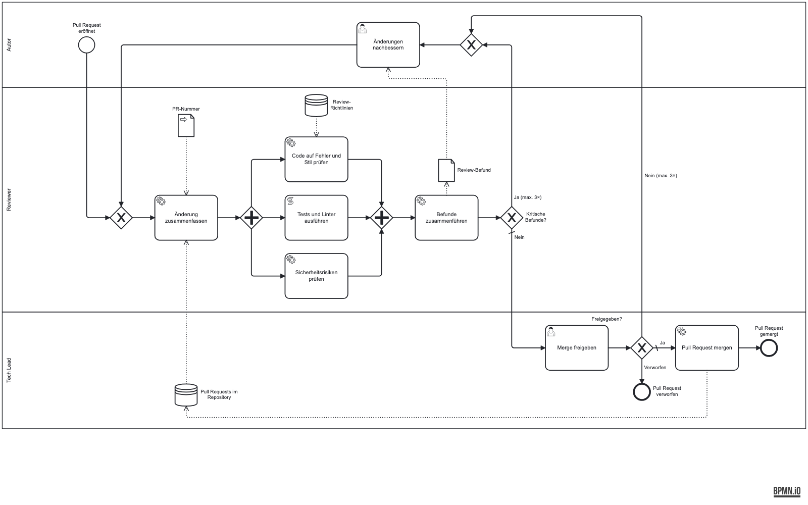

# Beispiel: Pull Request prüfen und mergen

Das kleinste Beispiel in diesem Repo: ein Prozess, den jeder Entwickler kennt, in einem Diagramm
mit 17 Elementen. Es zeigt die Notation auf einen Blick und eignet sich als Einstieg, bevor man
[`user-story-refinement`](../user-story-refinement/) oder [`dark-factory`](../dark-factory/) öffnet.



## Aufbau

- **Eine Ebene, drei Lanes** (Lane = Rolle): Autor, Reviewer (KI), Tech Lead.
- **Aufgabentypen**: `serviceTask` = KI-Arbeit (zusammenfassen, Code und Sicherheit prüfen,
  Befunde zusammenführen, mergen), `scriptTask` = Skript (Tests und Linter, immer gleiches Ergebnis),
  `userTask` = menschlicher Kontrollpunkt (Änderungen nachbessern, Merge freigeben).
- **Paralleles Gateway**: Code, Tests und Sicherheit laufen gleichzeitig und werden danach
  synchronisiert.
- **Schleife mit Obergrenze**: Bei kritischen Befunden oder abgelehnter Freigabe geht der Autor
  zurück zum Anfang der Prüfung, höchstens dreimal (`Ja (max. 3×)`, `Nein (max. 3×)`). Der
  Rückfluss läuft über ein eigenes Merge-Gateway vor dem ersten Schritt der Schleife.
- **Zwei Enden**: `Pull Request gemergt` und `Pull Request verworfen`.
- **Kontext**:
  - `Review-Richtlinien` (`Art: wissen`, `Ort: datei:docs/review-guidelines.md`) wird nur gelesen,
    von der Code-Prüfung.
  - `Pull Requests im Repository` (`Art: live`, `Ort: cli:gh`) wird von der Zusammenfassung gelesen
    und vom Merge geschrieben. Vor dem Schreiben steht der User Task `Merge freigeben`.
  - `Review-Befund` ist die Übergabe von `Befunde zusammenführen` an `Änderungen nachbessern`.
  - Die Prozesseingabe ist die `PR-Nummer`.

## Ausprobieren

Aus diesem Ordner, mit installiertem Plugin (siehe [Schnellstart](../../README.md#schnellstart)):

```text
/flowforge:flowforge-run
```

Das Ergebnis landet unter `generated/pr-review/`. Es ist noch nicht in diesem Repo eingecheckt.

## Der Beweis: Rückverfolgbarkeit

Nach dem Erzeugen die Prüfung absichtlich brechen:

1. Eine erzeugte Datei löschen, etwa den Skill für `Sicherheitsrisiken prüfen`.
2. `/flowforge-verify` laufen lassen. Es meldet das BPMN-Element ohne Umsetzung.
3. Eine Datei anlegen, die auf kein Element verweist. Verify meldet sie als verwaist.

Jede erzeugte Datei trägt `bpmn: {file, elements}`, und die Prüfung läuft in beide Richtungen.

## Neu zeichnen

Das Diagramm ist handgesetzt und besteht `bpmn-authoring/scripts/validate.sh` ohne Befund. Nach einer
Änderung am `.bpmn` das PNG neu erzeugen:

```bash
node ../../.agents/skills/bpmn-authoring/scripts/render.mjs ~/.cache/bpmn-authoring-tools pr-review.bpmn .
mv top-level.png pr-review.png
```
